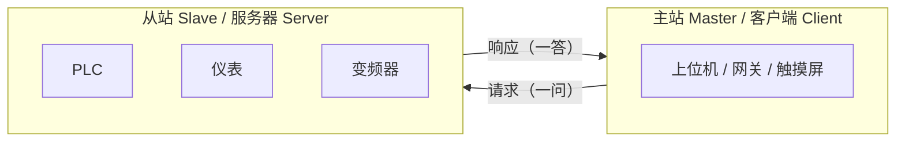
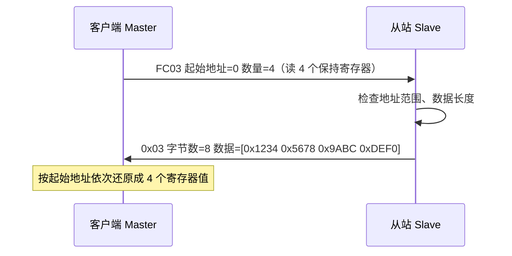
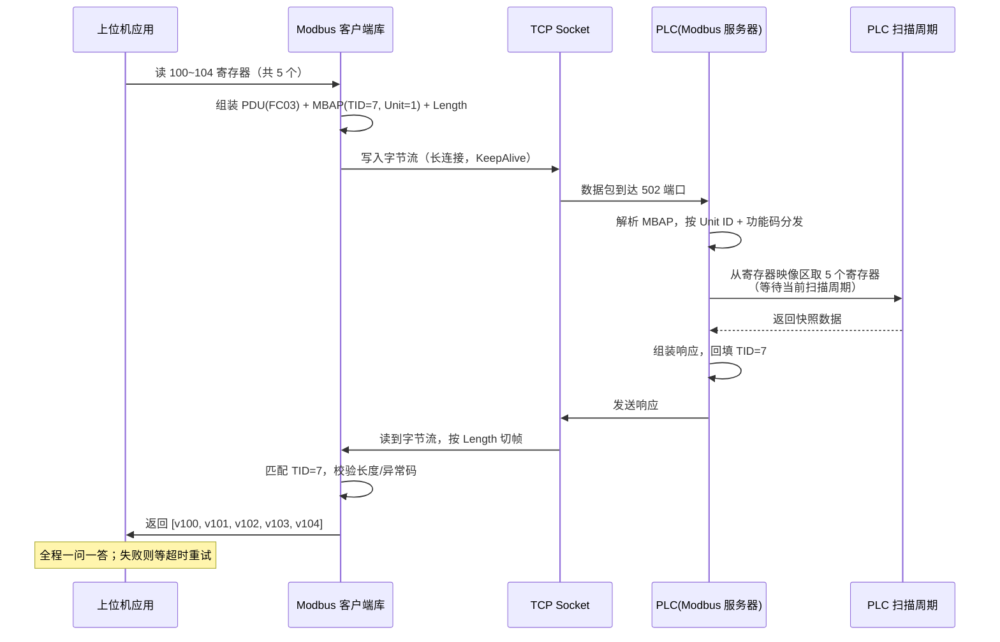

# Modbus 深度剖析：RTU / TCP 读取原理与并发模型

> 本文不讨论"怎么发一条报文"，而讨论"报文为什么长这样、PLC 侧到底怎么处理、多个请求并发时会发生什么"。
> 目标是把 Modbus 的通信模型（主从/客户端-服务器）、数据模型（四张表）、帧结构（PDU/ADU/MBAP）、RTU 与 TCP 的读取原理、
> 以及并发读取的瓶颈与工程模型讲清楚。
>
> 标准依据：**Modbus Application Protocol V1.1b3** + **Modbus over Serial Line V1.02**。

---

## 目录

1. [Modbus 是什么：一个 1979 年出生的"工业普通话"](#1-modbus-是什么一个-1979-年出生的工业普通话)
2. [通信模型：主从 与 客户端-服务器](#2-通信模型主从-与-客户端服务器)
3. [数据模型：四张"表"](#3-数据模型四张表)
4. [帧结构总览：PDU / ADU / MBAP](#4-帧结构总览pdu--adu--mbap)
5. [读操作详解：FC01~FC04](#5-读操作详解fc01fc04)
6. [异常响应：错误怎么报](#6-异常响应错误怎么报)
7. [Modbus RTU 的读取原理：串口上的半双工对话](#7-modbus-rtu-的读取原理串口上的半双工对话)
8. [Modbus TCP 的读取原理：TCP 上的事务号对话](#8-modbus-tcp-的读取原理tcp-上的事务号对话)
9. [RTU vs TCP：一张表看清](#9-rtu-vs-tcp一张表看清)
10. [一次完整读取的生命周期](#10-一次完整读取的生命周期)
11. [并发读取：核心问题](#11-并发读取核心问题)
12. [工程上的并发模型](#12-工程上的并发模型)
13. [常见误区速查表](#13-常见误区速查表)

---

## 1. Modbus 是什么：一个 1979 年出生的"工业普通话"

### 🎯 一句话：Modbus 是 PLC/仪表/变频器之间最通用的"应用层协议"，只定义"报文长什么样、谁先说话"

Modbus 由 Modicon（现在的施耐德电气）于 1979 年发布，最初跑在串口上（Modbus RTU / ASCII），
后来扩展出跑在 TCP/IP 上的 **Modbus TCP**。它不关心底层是 RS-232、RS-485 还是以太网——它只定义三层东西：

1. **谁先说话**（通信模型：一主多从，一问一答）；
2. **数据放在哪**（数据模型：线圈、离散输入、保持寄存器、输入寄存器）；
3. **报文格式**（帧结构：功能码 + 数据 + 校验）。

几乎所有 PLC 都原生支持 Modbus，这就是它被称为"工业界的普通话"的原因。



---

## 2. 通信模型：主从 与 客户端-服务器

### 🎯 一句话：RTU 是"一主多从、总线广播、从站只回答自己"，TCP 是"多客户端连一个服务器、按事务号认领应答"

| 维度 | Modbus RTU（串口） | Modbus TCP（以太网） |
|---|---|---|
| 角色命名 | 主站 Master / 从站 Slave | 客户端 Client / 服务器 Server |
| 谁先说话 | **只有主站**能发起请求，从站永远被动 | 客户端主动，服务器被动 |
| 从站/服务器数量 | 一条总线最多 247 个从站（地址 1~247） | 一个服务器可被多个客户端连接 |
| 寻址方式 | 报文第 1 字节 = 从站地址，总线广播 | 每个连接都是点对点，Unit ID 保留 |
| 并发发起者 | **只有 1 个**（主站） | **可有多个**（多个客户端/多条连接） |
| 底层介质 | RS-232（点对点）/ RS-485（多机总线） | TCP/IP，默认端口 **502** |
| 是否半双工 | 是（共享总线，同一时刻只有一方发声） | 否（全双工，收发互不干扰） |

关键认知：**"主从"和"客户端-服务器"是同一套报文逻辑在不同传输层上的两种叫法**。
功能码、数据模型、PDU 结构完全一样，区别只在传输层的"信封"（RTU 帧 vs MBAP 头）和"邮局规则"（半双工时序 vs TCP 连接管理）。

---

## 3. 数据模型：四张"表"

### 🎯 一句话：PLC 的内存对 Modbus 来说就是四张表，读哪个用哪个功能码，一张表对应一个"命名空间"

Modbus 把设备内部数据抽象成四张逻辑表，每张表用功能码区分，地址从 0 开始编号：

| 表 | 类型 | 最小单元 | 读功能码 | 写功能码 | 最大数量/次 |
|---|---|---|---|---|---|
| 线圈 Coils | 可读可写 | 1 bit | **FC01** Read Coils | FC05/FC15 | 2000 个 |
| 离散输入 Discrete Inputs | 只读 | 1 bit | **FC02** Read Discrete Inputs | 无 | 2000 个 |
| 保持寄存器 Holding Registers | 可读可写 | 16 bit | **FC03** Read Holding Registers | FC06/FC16 | **125 个** |
| 输入寄存器 Input Registers | 只读 | 16 bit | **FC04** Read Input Registers | 无 | **125 个** |

注意三点：

- **地址是从 0 开始的功能码内地址**，不是 PLC 里的绝对地址。PLC 侧的映射（如西门子的 DB 块、AB 的 Tag）由厂商固件决定，报文里只有相对地址。
- 物理上四张表可能映射到同一片内存，也可能各自独立，**从协议角度它们是完全独立的命名空间**——地址 0 在线圈里和地址 0 在保持寄存器里是两个不同的东西。
- 32 位浮点数 / 长整型在保持寄存器里占 **2 个连续寄存器**（大端字序，Modbus 默认 Big-Endian，字节序有厂商差异，需要配置）。

---

## 4. 帧结构总览：PDU / ADU / MBAP

### 🎯 一句话：所有 Modbus 报文 = 不变的"业务部分"PDU + 变化的"传输信封"ADU

Modbus 把所有报文统一成两层结构：

```
PDU（Protocol Data Unit，协议数据单元）：功能码 + 数据          ← 两种协议完全一样
ADU（Application Data Unit，应用数据单元）：寻址 + PDU + 校验   ← 由传输层决定
```

### RTU 的 ADU（串口帧）

```
┌──────────┬──────────┬──────────────┬──────────┐
│ 从站地址 │ 功能码   │ 数据         │ CRC16    │
│ 1 字节   │ 1 字节   │ N 字节       │ 2 字节   │
│ 1~247    │ FC       │              │ 低字节在前│
└──────────┴──────────┴──────────────┴──────────┘
最大帧长 256 字节
```

### TCP 的 ADU（MBAP + PDU）

```
┌───────────────┬───────────────┬──────────┬──────────┬──────────────┐
│ 事务标识符    │ 协议标识符    │ 长度     │ 单元标识符│ 功能码 + 数据 │
│ Transaction ID│ Protocol ID   │ Length   │ Unit ID  │ PDU          │
│ 2 字节        │ 2 字节        │ 2 字节   │ 1 字节   │ N 字节       │
│ 客户端自增     │ 恒为 0x0000   │ 后面字节数│ 从站地址 │              │
└───────────────┴───────────────┴──────────┴──────────┴──────────────┘
←──────────────── MBAP 头 7 字节 ───────────────→
```

TCP 帧的四个 MBAP 字段各司其职：

- **事务标识符（Transaction ID）**：客户端每次请求自增，服务器**原样回填**。这就是 TCP 并发匹配应答的关键（见 §11.3）。
- **协议标识符（Protocol ID）**：恒为 0，表示这是 Modbus 协议（保留字段，为将来其他协议留的）。
- **长度（Length）**：Unit ID + PDU 的字节数，用于在字节流里切帧（TCP 是流协议，没有"帧"的概念，靠这个字段定界）。
- **单元标识符（Unit ID）**：RTU 从站地址的"继承者"。直连 PLC 时填 1；经过网关时，用来告诉网关"去问总线上的几号从站"。

> **为什么 TCP 帧没有 CRC？**
> RTU 的 CRC16 是用来防串口线路噪声和电气干扰的（波特率 9600 时丢 1 bit 很常见）。
> TCP 底层已有校验和 + 重传保证数据完整，再加 CRC 是纯浪费，所以 Modbus TCP 删掉了它。

---

## 5. 读操作详解：FC01~FC04

### 🎯 一句话：读操作都是"请求给起点 + 数量，响应给按位/按寄存器打包的数据"

以最常用的 **FC03 读保持寄存器** 为例（其余三个结构完全对称）：

```
请求（客户端 → 服务器）：
┌──────────┬─────────────────┬──────────────┐
│ 功能码   │ 起始地址         │ 寄存器数量    │
│ 0x03     │ 2 字节（0~65535）│ 2 字节（1~125）│
└──────────┴─────────────────┴──────────────┘

响应（服务器 → 客户端）：
┌──────────┬───────────┬────────────────────────────┐
│ 功能码   │ 字节数     │ 数据                       │
│ 0x03     │ 1 字节    │ 数量×2 字节，大端，连续     │
└──────────┴───────────┴────────────────────────────┘
```

FC01/FC02（读线圈/离散输入）响应里的数据是 **按位打包** 的：

- 每个 bit 代表一个线圈，bit 0 对应起始地址；
- 最后一字节不足 8 位时，**高位补 0**；
- 响应第一字节 = 有效字节数。



**为什么一次最多 125 个寄存器？** 因为 PDU 上限 253 字节：功能码 1 + 起始地址 2 + 数量 2 + 字节数 1 + 数据 2×125 = 253。这是标准规定的硬限制，一次想读 200 个寄存器就必须拆成两个请求。

---

## 6. 异常响应：错误怎么报

### 🎯 一句话：出错时功能码最高位置 1（+0x80），再附一个异常码，从站不撒谎说"读到了"

正常响应回显功能码；异常响应把功能码 **最高位（0x80）置 1**，并在数据区放一个异常码：

```
正常响应：0x03 ...
异常响应：0x83 异常码(1字节)
```

常见异常码（节选）：

| 异常码 | 含义 | 典型原因 |
|---|---|---|
| 0x01 | 非法功能码 | 设备不支持 FC03 |
| 0x02 | 非法数据地址 | 起始地址+数量 越界 |
| 0x03 | 非法数据值 | 数量=0 或超过 125 |
| 0x04 | 服务器设备故障 | PLC 程序异常 |
| 0x06 | 服务器繁忙 | 从站忙不过来（串口从站常见） |

> 工程要点：**超时 ≠ 异常**。从站没回（掉线、串口断线、地址错）表现为超时；异常响应表现为"收到但内容是错误"。两者要分开统计。

---

## 7. Modbus RTU 的读取原理：串口上的半双工对话

### 🎯 一句话：RTU 是"一根线、一个话筒"——所有人听，只有被点名的人能回话，且回话必须接在请求后面

### 7.1 串口是共享的广播总线

RS-485 多机接线下，所有从站并联在同一对差分线上，**物理上就是一根"话筒"**：

- 主站说话 → 所有从站都能听到（广播）；
- 从站比对帧头地址，**只有地址匹配的从站**才回话；
- 同一时刻只允许一方发声——**这是 RTU 并发的最根本约束**。

### 7.2 帧与帧之间的"静默时间"：3.5 字符间隔

串口是字节流，没有帧边界，怎么判断一帧结束？靠 **时间**：

- 帧内相邻字节间隔 < **1.5 个字符时间**；
- 帧与帧之间至少 **3.5 个字符时间** 的静默。

```
<3.5字符静默> [地址][功能码][数据][CRC] <3.5字符静默> [下一帧...]
              └──────────── 一帧 ────────────┘
```

以 9600 波特率 8N1 计算（1 字符 = 11 bit）：1 字符 ≈ 1.146 ms，3.5 字符 ≈ **4.0 ms**。
也就是说：**9600 波特下，主站读完响应后至少等 4ms 才能发下一条**——这直接限制了 RTU 的单站轮询吞吐。

### 7.3 CRC16：串口专用的"验货章"

RTU 用 **CRC-16/MODBUS**（多项式 0xA001，初值 0xFFFF），**低字节在前**发送。
它的作用不是安全（防黑客），而是**防电气干扰**：串口长线容易受电机启停、变频器谐波干扰，一个 bit 翻转就可能把地址/数据改坏。CRC 算不过就丢弃整帧，主站等超时重发。

### 7.4 RTU 的读取吞吐上限

单条 9600 波特总线的理论极限可以粗算：

- 读 10 个保持寄存器：请求 ≈ 8 字节，响应 ≈ 23 字节，加 2 次 4ms 静默；
- 一回合 ≈ (8+23)×11 / 9600 s + 8ms ≈ 35ms + 8ms ≈ **43ms**；
- 轮询 1 个从站 ≈ 23 次/秒；轮询 10 个从站，每个每秒只有 2~3 次。

**结论：RTU 的并发不是"同时读"，而是"排队轮着读"，吞吐由波特率 + 从站数量共同决定。**

---

## 8. Modbus TCP 的读取原理：TCP 上的事务号对话

### 🎯 一句话：TCP 把"物理总线"换成了"虚拟管道"，但应用层仍然是一问一答，靠事务标识符对号入座

### 8.1 从总线到连接

TCP 模式下，每个客户端-服务器之间是独立的点对点连接，**不再有"总线冲突"**：

- 客户端 A 和客户端 B 可以同时连同一个 PLC；
- 各自连接上的报文互不干扰；
- 底层 TCP 保证字节有序、不丢、不重（靠序号 + 校验和 + 重传）。

### 8.2 为什么还需要事务标识符

TCP 是**字节流**，一个连接上连续发两个请求，响应回来时怎么区分谁是谁？

```
客户端发：TID=1001 读 1~10 寄存器
客户端发：TID=1002 读 20~30 寄存器   ← 不等上一条响应就发（交织）

服务器回：TID=1001 数据...
服务器回：TID=1002 数据...            ← 可能乱序到达

客户端按 TID 认领：1001 给请求A，1002 给请求B
```

**事务标识符就是"对号入座"的号码牌**，它让同一个连接上的多个请求可以交织而不混淆。

### 8.3 但标准上仍然推荐"一问一答"

虽然 TID 支持交织，Modbus 规范的默认行为是**服务器逐个处理请求**（很多 PLC 固件就是串行处理的，见 §11.4），
所以"管道化（pipelining）"在 Modbus 里不像 HTTP/2 那样是标准能力，更多是客户端库的选择：

- 保守做法（也是主流库的默认）：同一连接上**发一条等一条**，超时才重发；
- 激进做法：连续发多条，按 TID 匹配——**部分从站支持，部分不支持，容易踩坑**；
- 想真正并行，工程上更稳的做法是**开多条连接**（§12.2）。

### 8.4 TCP 连接本身的开销

- 默认端口 **502**（需要 root/管理员权限绑定 <1024 的端口，这是网关常见坑）；
- 每次建连有 TCP 三次握手 + 四次挥手，**短连接轮询 = 巨大浪费**，工程上必须**长连接 + 保活（KeepAlive）**；
- 但服务器侧连接数有限（PLC 通常 4~16 个，见 §11.1），连接也不是想开多少开多少。

---

## 9. RTU vs TCP：一张表看清

| 维度 | Modbus RTU | Modbus TCP |
|---|---|---|
| 底层 | RS-232 / RS-485 串口 | TCP/IP，端口 502 |
| 寻址 | 帧头 1 字节从站地址（总线广播） | 点对点连接，Unit ID 保留 |
| 帧定界 | 时间（3.5 字符静默） | Length 字段 |
| 校验 | CRC16（防线路干扰） | TCP 校验和（协议自带） |
| 全/半双工 | 半双工，一方发声 | 全双工，可同时收发 |
| 单次读上限 | 寄存器 125 / 线圈 2000（PDU 限制，两者相同） | 相同（PDU 一致） |
| 并发发起方 | 只有 1 个主站 | 多个客户端、多条连接 |
| 并发瓶颈 | 波特率 + 总线静默时间 + 从站数 | PLC 连接数上限 + 从站处理速度 |
| 典型吞吐 | 9600 波特 ≈ 20~25 次读/秒/总线 | 局域网往返 <1ms，吞吐高 1~2 个数量级 |
| 典型场景 | 老旧产线、传感器仪表、远距离多机 | 中控室、上位机、与 IT 系统对接 |
| 互转 | —— | 网关把 TCP 翻译成 RTU 挂总线（§12.4） |

---

## 10. 一次完整读取的生命周期

以「上位机通过 Modbus TCP 读 PLC 保持寄存器」为例，串起所有概念：



这里的隐藏环节是 **PLC 的扫描周期**：Modbus 请求不是"CPU 立即执行"，而是通信模块/通信任务在扫描周期内的某个时隙取数。**读到的永远是"上一拍的快照"，不是"此时此刻的值"**——这是理解 PLC 读取一致性的关键（§11.6）。

---

## 11. 并发读取：核心问题

### 11.1 并发到底受什么限制

| 限制层 | RTU | TCP |
|---|---|---|
| 物理层 | 半双工总线，同时只有一方发声 | 全双工，无物理冲突 |
| 协议层 | 只有 1 个主站 | 多客户端，但**服务器串行处理**为主 |
| 服务器(PLC)层 | 从站一次处理一个请求 | **连接数上限**（很多 PLC 4~16 个） |
| 数据层 | 无并发问题（天然排队） | 多个请求可能读到"不同拍"的数据 |

**一个残酷的事实：Modbus 从来就不是一个"高并发读"的协议。** 它的设计目标是"可靠、简单、被全世界 PLC 支持"，
并发上限通常来自从站侧，而不是主站侧能发多快。

以常见 PLC 为例（以各厂商手册为准）：

- 西门子 S7-1200 的 Modbus TCP 从站块通常支持 **4 个左右**并发连接；S7-1500 更高；
- 许多中低端仪表/变频器的 TCP 从站**只支持 1 个连接**，第二个客户端连接直接拒绝；
- 串口从站压根没有"并发"概念——主站发一条，它回一条，天然串行。

### 11.2 RTU 并发：本质是时分复用

RTU 上"多个数据要读"时，没有并发只有**排队**：

```
主站：读 从站1 的寄存器 → 等响应(≈40ms) → 读 从站2 → 等响应 → 读 从站1 的另一段...
时间轴：|←─回合1─→|←─回合2─→|←─回合3─→|
```

- **轮询周期 ≥ 单回合时间 × 回合数**；
- 想提高吞吐只有三条路：① 提高波特率（115200 是常见上限）；② **批读取**（一次多读，§11.5）；③ 减少从站数量/分总线。
- 多线程对 RTU **毫无意义**：总线是共享的，两个线程同时写串口只会把帧搅乱。**必须用一个互斥锁串行化访问串口。**

### 11.3 TCP 并发：连接、事务 ID 与交织

TCP 模式的并发有四个层次，从低到高：

**层次 1：单连接串行**（最稳）
```
连接1：读A → 等 → 读B → 等 → 读C ...
```
同一连接上严格一问一答，TID 恒递增，不会乱。大多数客户端库的默认行为。

**层次 2：单连接交织（pipelining）**（部分从站支持）
```
连接1：读A → 读B → 读C（不等响应）
连接1：← 响应C ← 响应B ← 响应A（按 TID 认领）
```
吞吐提升有限，且**很多 PLC 从站固件不支持**，容易遇到"请求丢失/乱序/超时"，工程上慎用。

**层次 3：多连接并行**（最常见的高吞吐方案）
```
连接1：读 1~125 寄存器
连接2：读 126~250 寄存器
连接3：读 251~375 寄存器
```
每个连接独立一问一答，互不阻塞。**有效吞吐 ≈ 连接数 × 单连接吞吐**，但要受 §11.1 的连接数上限约束。

**层次 4：多客户端 / 多上位机**（架构级并发）
多台机器同时读同一个 PLC。PLC 侧同样按连接处理，瓶颈还是 PLC 的处理能力和连接上限。

> **关键结论**：Modbus TCP 的"并发"主要靠**多连接**实现，而不是"单连接内流水线"。
> 事务标识符（TID）的存在是为了让多请求交织时不错配，但它不是标准化的流水线能力。

### 11.4 轮询周期与 PLC 扫描时间

无论 RTU 还是 TCP，读取频率都受 PLC 侧两个时间约束：

1. **扫描周期（Scan Time）**：PLC 程序循环执行一遍的时间，典型 1~50ms。Modbus 从站块（如西门子 MB_SERVER、施耐德 MB_S）在程序里被周期调用，**每次调用处理一批请求**。扫描周期越长，响应越慢。
2. **通信任务时隙**：请求排队等下一个扫描周期才被处理。

所以轮询周期（Poll Interval）的合理设置是：

```
轮询周期 ≥ PLC 扫描周期 + 网络往返 + 余量
（经验值：PLC 扫描 10ms，局域网轮询周期通常设 50~200ms，既不吃满 CPU 又不会丢拍）
```

**轮询间隔设得太短（如 1ms）不会读到更"新"的数据，只会：** 请求在 PLC 通信队列里堆积 → 队列满 → 0x06 服务器繁忙 / 超时 → 重试风暴。

### 11.5 批读取：少跑一趟，并发压力的终极解药

一次读 1 个寄存器和一次读 125 个寄存器，**协议开销几乎一样**（多 248 字节数据而已），所以：

| 方案 | 请求次数 | 总耗时(局域网 ~1ms/回合) | 对 PLC 的压力 |
|---|---|---|---|
| 逐个读 125 个寄存器 | 125 次 | ~125ms+ | 125 次解析 |
| 一次批读 125 个寄存器 | 1 次 | ~1ms | 1 次解析 |

**工程铁律：能一次读完的连续寄存器，绝不拆开读。** 把变量按"寄存器块"组织（如把一批模拟量连续摆放），
用一次 FC03 读整块，再在本地解析。这比任何并发技巧都有效。

### 11.6 一致性：并发读的隐藏雷区

并发读取时，数据一致性有三个层面：

**① 拍与拍之间（跨请求）**
每个请求读到的是 PLC"上一拍"的快照。两个请求即使相隔 1ms，读到的可能是 PLC 不同扫描周期的值——**这对大多数监控场景无影响，但对"先读 A 再根据 A 读 B"的联动逻辑是致命的**。

**② 块内一致性（单请求内）**
一次 FC03 读 125 个寄存器，PLC 侧**不一定保证原子快照**：它可能在扫描周期中途拷贝，遇到程序刚好在更新某几个寄存器，就会拿到"一半新一半旧"的数据。可靠性取决于厂商实现（西门子推荐把 Modbus 映射区做成程序不并发修改的 DB 区域）。

**③ 32 位值撕裂（双寄存器）**
32 位浮点/长整型占两个寄存器。如果请求边界刚好落在两个字之间——比如第 1 个请求读到"高字是新的、低字是旧的"——组合出来的值就是**撕裂值（torn read）**。
规避手段：把 32 位变量连续摆放并**整块批读**（保证两个字在同一响应里）；或在从站侧用一致性区域。

**并发加剧一致性问题吗？** 会。多连接并行读同一片区域时，各连接各自取快照，撕裂/错拍的概率按连接数放大。**工程结论：追求一致性的数据，用单连接串行批读；追求吞吐的数据，才上多连接。**

---

## 12. 工程上的并发模型

### 12.1 单线程轮询（最主流、最稳）

```
┌─────────────────────────────────────────┐
│ 轮询循环（单线程）                         │
│  1. 遍历设备列表                           │
│  2. 对每个设备：组装请求 → 发送 → 等响应   │
│     （超时 N ms → 记失败 → 继续下一个）     │
│  3. sleep(轮询间隔) → 回到 1               │
└─────────────────────────────────────────┘
```

- 优点：**时序确定**，不会把 PLC 打死，调试容易（看日志就能复现）；
- 缺点：吞吐有限，设备多时单设备轮询频率下降；
- 适用：中小规模（几十个设备以内）、对一致性敏感的监控/控制场景。**工业现场 90% 的 Modbus 采集都是这么干的。**

### 12.2 多线程 / 线程池（按连接分治）

```
┌─────────────┐   ┌─────────────┐   ┌─────────────┐
│ 线程 1       │   │ 线程 2       │   │ 线程 3       │
│ 连接 A       │   │ 连接 B       │   │ 连接 C       │
│ 设备组 1     │   │ 设备组 2     │   │ 设备组 3     │
└─────────────┘   └─────────────┘   └─────────────┘
```

- 划分原则：**一个连接绑定一个线程/任务，线程之间不共享串口和连接**；
- RTU：串口必须全局互斥（`lock` 包住整个"发+收"回合），否则两个线程抢总线；
- TCP：每个连接一个队列，线程从队列取请求、按 TID 匹配响应；
- 适用：设备多、追求吞吐的场景。注意别超过 PLC 连接数上限。

### 12.3 异步模型（事件驱动）

- 用非阻塞 IO + 事件循环（如 Python asyncio / Node.js / Go goroutine）管理**大量设备的同时读取**；
- 收益主要来自"**同时等很多个响应**"：一个设备 40ms 超时等待期间，CPU 去处理别的设备；
- 对单个 PLC 而言，异步不会让它变快——**PLC 侧还是串行处理**，异步消除的是主站侧的空转等待；
- 适用：网关类产品、大量仪表/变频器的集中采集（几百上千个点）。

### 12.4 网关场景：TCP 并发如何变成 RTU 排队

现场最常见的架构是**以太网网关挂串口总线**（或 PLC 自带串口从站）：

```
上位机(多个) ──TCP──► 网关 ──RTU(RS-485)──► 从站1/从站2/...从站N
```

- 多个 TCP 客户端并发请求到达网关后，网关把它们**翻译成 RTU 帧排队发上总线**；
- 总线吞吐重新成为瓶颈——**无论上面连了多少个客户端，总线上的轮询还是串行的**；
- 网关是天然的"并发汇流点"，内部队列长度、超时策略决定整体表现（队列满就丢请求/回 0x06）。

---

## 13. 常见误区速查表

| 误区 | 真相 |
|---|---|
| "Modbus TCP 有 CRC 校验" | ❌ 没有，完整性靠 TCP 保证；CRC 是 RTU 串口专属 |
| "多线程读 Modbus 就能提速" | ⚠️ 只对多连接有效；同一串口/同一连接上多线程只会捣乱 |
| "轮询间隔越短数据越新" | ❌ 读到的是 PLC 上一扫描周期快照，间隔 < 扫描周期没有意义 |
| "读 125 个寄存器和读 1 个一样快" | ✅ 协议开销几乎相同，所以**必须批读取** |
| "TID 是为了支持流水线" | ⚠️ 是为了匹配交织请求，但标准从站串行处理，流水线要测了才敢用 |
| "TCP 可以无限开连接" | ❌ PLC 通常 4~16 个连接上限，超了会被拒 |
| "RTU 总线上可以有两个主站" | ❌ 一主多从是硬规则，双主站会总线冲突 |
| "超时就是设备坏了" | ⚠️ 也可能是从站地址错、波特率错、网关没配置、繁忙未回 |
| "FC03 读的是 PLC 程序变量" | ⚠️ 读的是厂商映射的寄存器区（如西门子 DB 块），映射要查手册 |
| "并发读同一片数据不会有问题" | ⚠️ 多连接各自取快照，撕裂读/错拍概率按连接数放大 |

---

## 附录：常用功能码速查

| 功能码 | 名称 | 方向 |
|---|---|---|
| 01 (0x01) | 读线圈 | 读 |
| 02 (0x02) | 读离散输入 | 读 |
| 03 (0x03) | 读保持寄存器 | 读 |
| 04 (0x04) | 读输入寄存器 | 读 |
| 05 (0x05) | 写单个线圈 | 写 |
| 06 (0x06) | 写单个寄存器 | 写 |
| 15 (0x0F) | 写多个线圈 | 写 |
| 16 (0x10) | 写多个寄存器 | 写 |
| 23 (0x17) | 读写多个寄存器 | 读写 |
