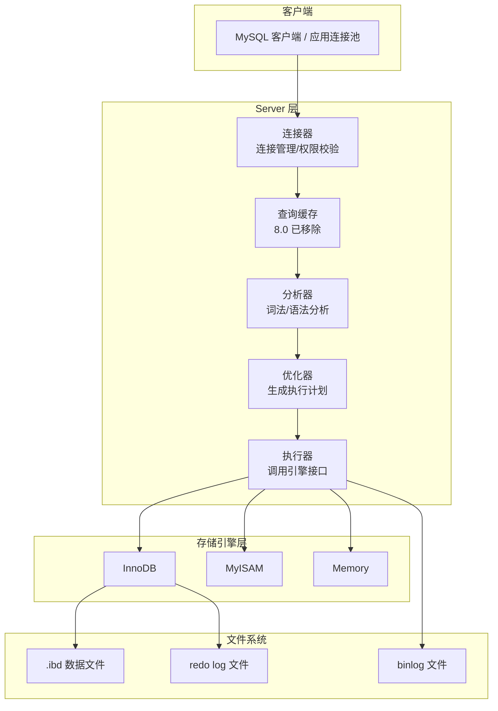
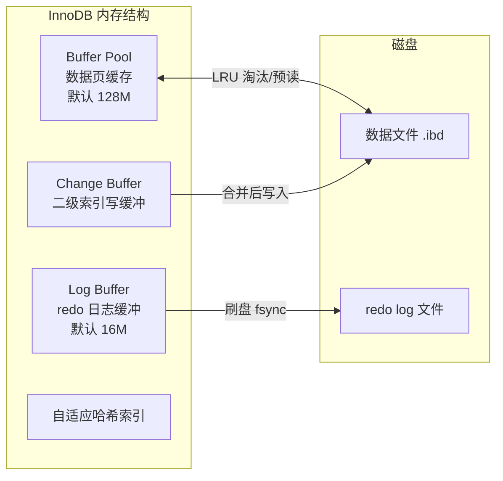
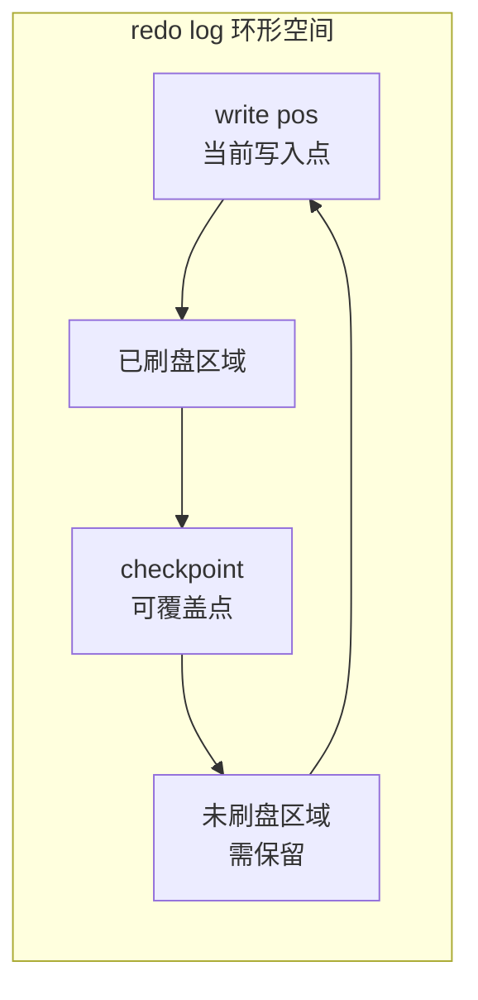
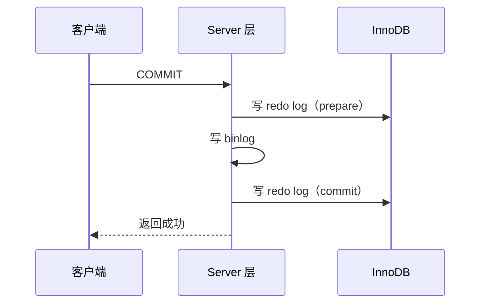
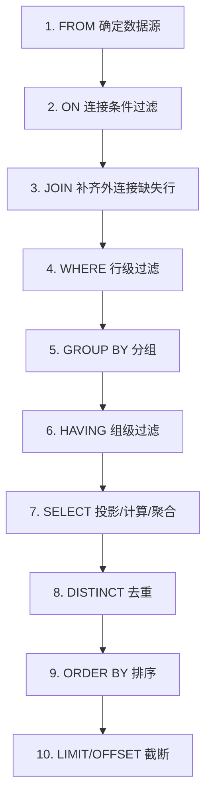
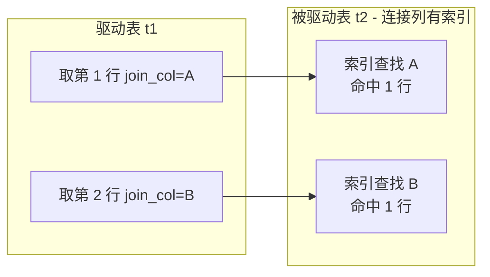
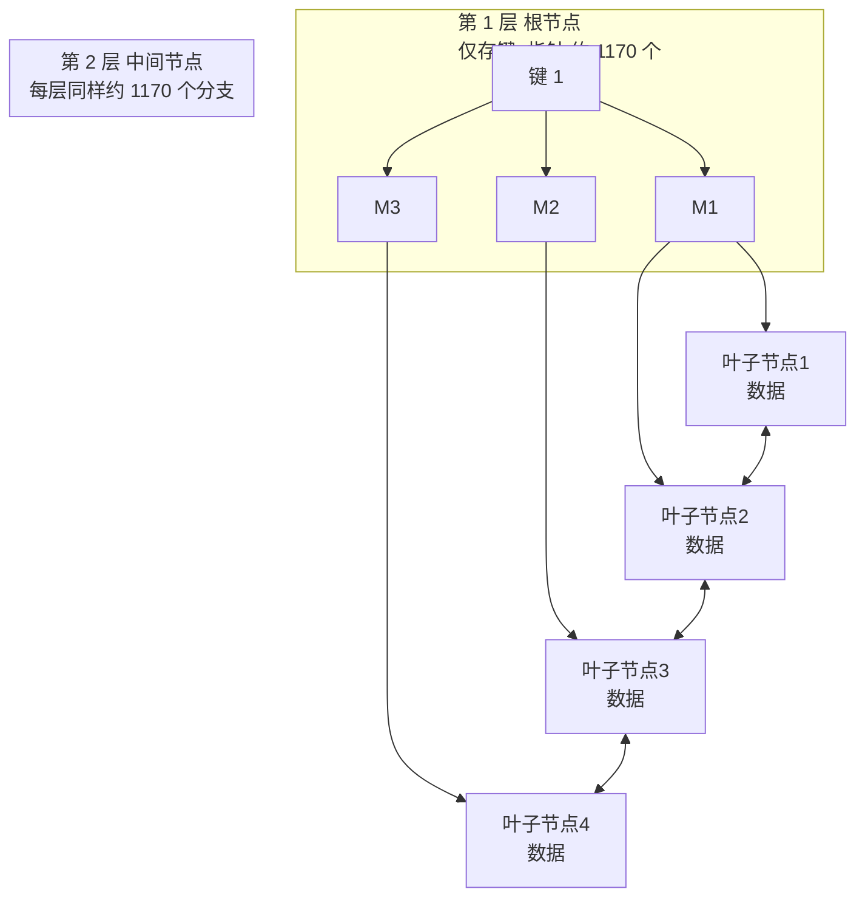
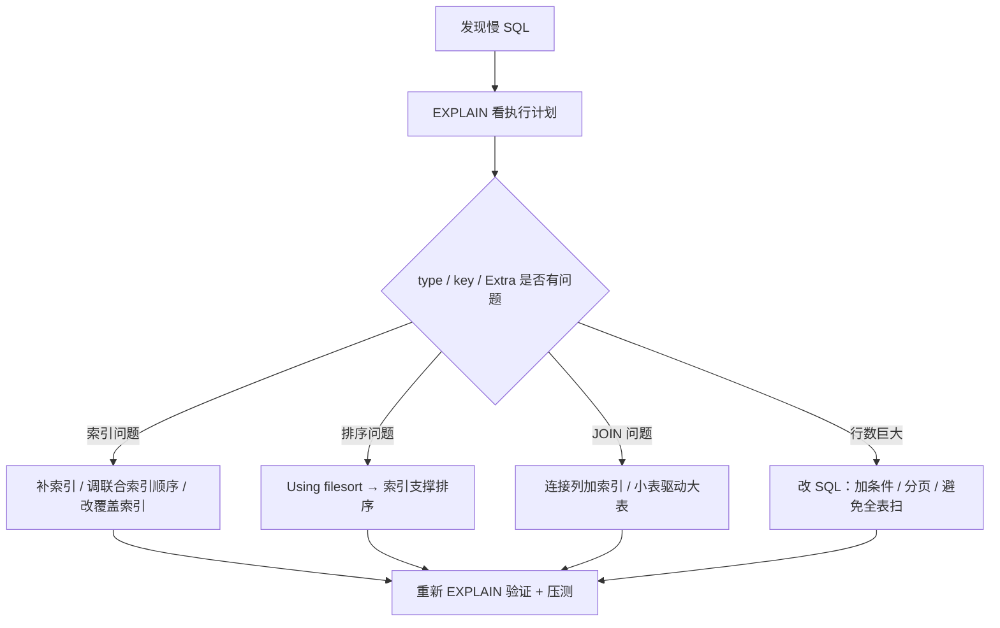

# MySQL 深度剖析：架构、执行顺序、索引与优化

> 本文不讨论"怎么写 SQL"，而讨论"一条 SQL 到底怎么跑起来、为什么慢、怎么让它快"。
> 目标是把 MySQL 的整体架构、SQL 关键字的逻辑执行顺序与物理执行原理、B+ 树索引的底层细节、以及查询优化的核心手段讲清楚。
>
> 分析对象为 **MySQL 5.7 / 8.0**（版本差异会单独注明），以 InnoDB 存储引擎为主。

---

## 目录

1. [整体架构：一条 SQL 的完整旅程](#1-整体架构一条-sql-的完整旅程)
2. [Server 层六大组件：连接器到执行器](#2-server-层六大组件连接器到执行器)
3. [InnoDB：为什么它是默认存储引擎](#3-innodb为什么它是默认存储引擎)
4. [InnoDB 内存结构：Buffer Pool 与日志缓冲](#4-innodb-内存结构buffer-pool-与日志缓冲)
5. [日志体系：redo / undo / binlog 与 WAL](#5-日志体系redo--undo--binlog-与-wal)
6. [磁盘存储结构：表空间、段、区、页、行](#6-磁盘存储结构表空间段区页行)
7. [一条 UPDATE 与一条 SELECT 的完整流程](#7-一条-update-与一条-select-的完整流程)
8. [SQL 关键字执行顺序：逻辑顺序与原理](#8-sql-关键字执行顺序逻辑顺序与原理)
9. [物理执行：优化器是怎么"重排"你的 SQL 的](#9-物理执行优化器是怎么重排你的-sql-的)
10. [JOIN 的四种执行原理](#10-join-的四种执行原理)
11. [索引：为什么是 B+ 树](#11-索引为什么是-b-树)
12. [B+ 树深入：一页能装多少数据](#12-b-树深入一页能装多少数据)
13. [聚簇索引、二级索引与回表](#13-聚簇索引二级索引与回表)
14. [覆盖索引：免回表](#14-覆盖索引免回表)
15. [联合索引与最左前缀原则](#15-联合索引与最左前缀原则)
16. [索引下推 ICP](#16-索引下推-icp)
17. [索引失效的典型场景](#17-索引失效的典型场景)
18. [其他索引类型：唯一、自适应哈希、全文](#18-其他索引类型唯一自适应哈希全文)
19. [索引设计原则与代价](#19-索引设计原则与代价)
20. [EXPLAIN 详解：读懂执行计划](#20-explain-详解读懂执行计划)
21. [慢查询与性能剖析工具](#21-慢查询与性能剖析工具)
22. [SQL 优化实战：分页、count、排序、子查询](#22-sql-优化实战分页count排序子查询)
23. [锁与 MVCC：并发控制的底层](#23-锁与-mvcc并发控制的底层)
24. [常见认知误区速查表](#24-常见认知误区速查表)

---

## 1. 整体架构：一条 SQL 的完整旅程

### 🎯 一句话：MySQL 是一个"两层结构 + 一条流水线"

MySQL 不是一个大一统的数据库，而是 **Server 层（服务层）+ 存储引擎层** 的组合：

- **Server 层**：负责连接管理、SQL 解析、优化、执行调度。它不关心数据怎么存。
- **存储引擎层**：负责数据的读写、索引的维护、事务的支持。它是可插拔的。

你写一句 SQL，Server 层把它"翻译、优化"成执行计划，然后交给存储引擎去真正读写磁盘上的文件。



### 分层思维导图

| 层 | 职责 | 典型组件 |
|---|---|---|
| 连接层 | 建立连接、鉴权、线程复用 | 连接器、连接池、线程模型（one thread per connection） |
| Server 层 | 解析、优化、执行调度 | 分析器、优化器、执行器、查询缓存（8.0 前） |
| 存储引擎层 | 数据组织、索引、事务、锁 | InnoDB、MyISAM、Memory、NDB |
| 文件系统层 | 持久化 | 数据文件 `.ibd`、日志文件、binlog、frm（8.0 并入数据字典） |

### 💡 为什么要分两层？

- **可插拔引擎**：同样的 Server 层，可以换不同引擎。需要事务就用 InnoDB，纯读归档可以用 MyISAM（更省空间），临时数据用 Memory。
- **关注点分离**：SQL 语义（Server 层）与物理存储（引擎层）解耦，优化器只需要面向引擎提供的"接口"（比如 `handler` 接口）工作。
- **代价**：引擎间差异被抹平，导致部分引擎特有功能无法暴露在 SQL 层（如全文索引、空间索引支持不一）。

---

## 2. Server 层六大组件：连接器到执行器

一条 SQL 在 Server 层要经过 **连接器 → 查询缓存（8.0 前）→ 分析器 → 优化器 → 执行器** 五个环节。

### 2.1 连接器（Connector）

- 负责建立连接、维持连接、权限校验。
- `mysql_native_password`（8.0 起为 `caching_sha2_password`）做身份认证，**权限在连接建立时读取一次**，之后即使你改了权限，已建立的连接依然按旧权限执行（除非重新连接或 8.0 的 `FLUSH PRIVILEGES` 配合）。
- 连接超时：`wait_timeout`（默认 8 小时），超过后连接被服务端断开。
- 一个连接 = 一个线程，内存占用约 1MB 左右（`thread_stack` 等），所以**连接不是越多越好**。长连接 vs 短连接：长连接避免频繁握手，但注意 `max_connections` 上限。
- **`SHOW PROCESSLIST`** 可以查看连接状态：`Sleep`（空闲）、`Query`（正在执行）。

### 2.2 查询缓存（Query Cache，8.0 已移除）

- 5.7 及之前：如果查询文本完全一致（字节级一致），且命中缓存，直接返回结果，跳过解析和执行。
- 为什么移除：缓存失效太频繁（**任何对表的写操作都会使该表所有缓存失效**），维护成本大于收益；在多核高并发场景下还有全局锁竞争。8.0 正式删除。

### 2.3 分析器（Parser）

两个阶段：

1. **词法分析**：把 SQL 拆成一个个 token（关键字、标识符、字面量）。
2. **语法分析**：根据语法规则构建语法树。语法错误（`You have an error in your SQL syntax`）就在这里报出来。

分析器只关心"语法对不对"，不关心"表存在不存在、走不走索引"——那是优化器的事。

### 2.4 优化器（Optimizer）

优化器的职责是：**在多个可行的执行计划里挑一个成本最低的**。

- 选择哪个索引（`possible_keys` → `key`）。
- 决定多表 JOIN 的连接顺序（先连谁、后连谁）。
- 决定子查询是物化、半连接还是改写为 JOIN。
- 决定是否使用索引下推、MRR、BKA 等优化手段。

成本模型：`server_cost` + `engine_cost`，主要看 **IO 次数 + CPU 成本**，依赖表的统计信息（`rows`、`cardinality`）。统计信息不准确时，优化器可能选错索引——解决办法是 `ANALYZE TABLE` 或使用 `FORCE INDEX`。

### 2.5 执行器（Executor）

执行器是"最后一棒"：

1. 先做权限检查（`SELECT` 的权限在优化器之前查，`UPDATE/DELETE` 的权限在执行器阶段查，涉及行级权限如触发器、视图）。
2. 调用存储引擎的 `handler` 接口（如 `InnoDB::index_read`）逐行读取。
3. 对每一行做 Server 层的过滤（`WHERE` 中不能被索引下推的条件）、计算、排序、聚合。
4. 返回结果给客户端。

> **一个关键认知**：**索引帮你"找到行"，但 WHERE 的精确过滤在 Server 层/引擎层都会发生**。索引下推（ICP）就是把部分 WHERE 条件"下推"到引擎层，减少回表。

---

## 3. InnoDB：为什么它是默认存储引擎

### 3.1 核心特性对比

| 特性 | InnoDB | MyISAM |
|---|---|---|
| 事务（ACID） | ✅（MVCC + redo/undo） | ❌ |
| 行级锁 | ✅（真正行锁 + 间隙锁） | ❌（仅表锁） |
| 崩溃恢复 | ✅（redo log） | ❌（可能丢数据/表损坏） |
| 外键 | ✅ | ❌ |
| 聚簇索引 | ✅（数据按主键组织） | ❌（数据文件与索引分离） |
| 全文索引 | ✅（5.6+） | ✅ |
| 压缩 | ✅ | ✅ |
| 适合场景 | 读写混合、高并发、事务 | 只读/归档、全文检索旧场景 |

### 3.2 InnoDB 的"三板斧"

1. **聚簇索引组织表**：数据行按主键物理顺序存放，主键查询极快。
2. **MVCC（多版本并发控制）**：通过 undo log 版本链 + ReadView，实现"读不阻塞写、写不阻塞读"的隔离级别。
3. **WAL（Write-Ahead Logging）**：先写日志、再刷数据页，保证崩溃恢复不丢已提交事务。

---

## 4. InnoDB 内存结构：Buffer Pool 与日志缓冲



### 4.1 Buffer Pool（缓冲池）

- 内存中最核心的部分，缓存 **数据页** 和 **索引页**，默认 `128MB`（8.0 默认 128M，建议设为物理内存的 60%~80%）。
- 单位是 **页（Page，16KB）**，以页为单位读写。
- 淘汰算法：**改进版 LRU**——链表分为 young（前 5/8）和 old（后 3/8）两段：
  - 新读入的页先放在 old 区头部；
  - 在 old 区存活超过 `innodb_old_blocks_time`（默认 1000ms）且再次访问，才晋升 young 区。
  - 目的：防止全表扫描一次性把热数据全部挤出去（避免"缓存污染"）。
- **预读（Read Ahead）**：顺序读取时，引擎会把相邻页一起读入，减少磁盘 IO 次数。

### 4.2 Change Buffer（写缓冲，5.5 前叫 Insert Buffer）

- 专门缓存 **二级索引（非唯一）的插入/更新** 操作，等数据页真正被读到 Buffer Pool 时再合并。
- 为什么只针对二级索引：二级索引通常不是有序访问的，写磁盘是随机 IO，成本高；延迟合并可以变随机写为顺序写。
- 注意：**唯一索引不能用 Change Buffer**（必须立即判断唯一性冲突，需要立刻读页）。

### 4.3 Log Buffer（日志缓冲）

- redo log 先写内存缓冲（Log Buffer，默认 16MB），再按策略刷盘。
- 刷盘时机由 `innodb_flush_log_at_trx_commit` 控制：
  - `0`：每秒刷一次（可能丢最多 1 秒日志）；
  - `1`（默认）：**每次事务提交都 fsync**，最安全；
  - `2`：每次提交写入 OS cache，每秒 fsync（OS 崩溃会丢，MySQL 崩溃不丢）。

### 4.4 自适应哈希索引（Adaptive Hash Index，AHI）

见 [第 18 节](#18-其他索引类型唯一自适应哈希全文)，先记住：它是 InnoDB **自动为热点页建立的哈希索引**，不占磁盘、不消耗用户内存，用于加速等值查询。

---

## 5. 日志体系：redo / undo / binlog 与 WAL

这是 MySQL 最容易被问懵、又最能体现"为什么这么设计"的部分。

### 5.1 三种日志的定位

| 日志 | 作用 | 类型 | 记录内容 | 归谁管 |
|---|---|---|---|---|
| redo log | 崩溃恢复（InnoDB 数据不丢） | 物理日志 | 页级别的修改（"第 X 页第 Y 偏移写入了什么"） | InnoDB |
| undo log | 事务回滚 + MVCC 版本链 | 逻辑日志 | 修改前的旧数据（"反操作"） | InnoDB |
| binlog | 主从复制、数据恢复、审计 | 逻辑日志 | 完整 SQL 事件（"干了什么"） | Server 层 |

### 5.2 WAL：先写日志，再改数据

**WAL（Write-Ahead Logging）** 的核心思想：磁盘顺序写日志（快）远比随机写数据页（慢）便宜，所以：

1. 事务提交时，**只把 redo log 刷到磁盘**（顺序写，追加式，速度快），事务就算提交成功了；
2. 数据页可以留在 Buffer Pool 里"脏"着，等后面某个时机（checkpoint、LRU 淘汰、`innodb_flush_log_at_trx_commit`）再刷盘；
3. 万一 MySQL 崩溃，重启时用 redo log **重放**，把没来得及刷盘的修改恢复出来。

这就是"**redo log 保证已提交事务不丢失（持久性）**"的原理。

### 5.3 redo log 为什么是"环形"的

redo log 是固定大小、循环写（`ib_logfile0`/`ib_logfile1`，8.0.30 起为 `#ib_redo*`）：



- `write pos`：当前日志写到哪；
- `checkpoint`：数据页已经刷到哪，checkpoint 之前的位置**可以覆盖**；
- 两者之间的区域是"待刷盘"的日志，不能覆盖。

**Buffer Pool 不够大或写入太快 → checkpoint 追不上 → 触发"刷脏页" → 性能抖动**。这也是 `innodb_buffer_pool_size` 需要设大的原因之一。

### 5.4 两阶段提交（Two-Phase Commit）

redo log 属于 InnoDB，binlog 属于 Server 层，**两份日志必须一致**，否则崩溃恢复后数据可能与 binlog 不一致（主从复制会错乱）。

解法是**两阶段提交**：

1. InnoDB 写 redo log，状态置为 **prepare**；
2. Server 层写 binlog；
3. InnoDB 把 redo log 状态改为 **commit**。



> 为什么必须两阶段？如果在写 binlog 前崩溃，binlog 里没有这条事务，从库不会执行——但 prepare 状态会让主库恢复时把该事务回滚，两边一致。如果在写 binlog 后、commit 前崩溃，主库恢复时发现 redo log 是 prepare 且 binlog 存在，则**补提交**（commit），两边一致。总之保证"**binlog 里有，redo log 就必然提交**"。

### 5.5 undo log 与版本链

- undo log 记录"修改前的值"，用于**事务回滚**。
- 同时每行记录里有隐藏列 `DB_TRX_ID`（最后修改事务 ID）和 `DB_ROLL_PTR`（回滚指针），串成**版本链**，配合 ReadView 实现 MVCC 快照读。

---

## 6. 磁盘存储结构：表空间、段、区、页、行

InnoDB 把磁盘空间组织成 **表空间（Tablespace）→ 段（Segment）→ 区（Extent）→ 页（Page）→ 行（Row）** 五级。

### 6.1 各级概念

| 层级 | 大小 | 说明 |
|---|---|---|
| 表空间 | 不固定 | 系统表空间 `ibdata1` / 每表独立 `.ibd`（`innodb_file_per_table=ON`） |
| 段 | — | 数据段（B+ 树叶子节点）、索引段（非叶子节点）、回滚段 |
| 区 | 1MB = 64 页 | 连续分配的最小单位，避免页碎片化 |
| 页 | 16KB（默认） | **读写的最小单位**，页内包含多条行记录 |
| 行 | 不定 | 一行数据，行格式 Compact/Dynamic（8.0 默认 Dynamic） |

### 6.2 页的内部结构

一个 16KB 的数据页大致包含：

```
+-----------------------------+
| File Header    38B          |  页号、上一页/下一页指针（页之间是双向链表）
| Page Header    56B          |  页类型、记录数、槽位信息
| Infimum / Supremum 13B      |  页内最小/最大伪记录（便于二分查找边界）
| User Records                |  真正的行数据（按主键有序）
| Free Space                  |  空闲空间
| Page Directory              |  槽位数组（记录分组指针，支持二分定位）
| File Trailer    8B          |  校验和，用于检测页是否写坏
+-----------------------------+
```

**页内行记录按主键顺序物理排列**，Page Directory 把记录分组，通过槽位**二分查找**定位行，而不是线性扫描。

### 6.3 行格式与隐藏列

每一行（Compact/Dynamic 格式）包含：

- **记录头信息**（5 字节）：`delete_mask`、`min_rec_mask`、`n_owned`、`heap_no`、`record_type`（普通/节点指针/最小/最大）、`next_record`（下一条记录偏移，逻辑链表）。
- **变长字段长度列表 + NULL 值位图**。
- **真实数据**：各列的值。
- **隐藏列**（用户不可见）：
  - `DB_ROW_ID`（6B，无主键且无唯一键时才生成，用作隐式主键）
  - `DB_TRX_ID`（6B，最后一次修改该行的事务 ID）
  - `DB_ROLL_PTR`（7B，指向 undo log 中旧版本的指针）

> 行溢出：`TEXT`/`BLOB` 等大字段，行放不下时，Dynamic 格式在行内只存 **20 字节的指针**，数据放到"溢出页"中。

---

## 7. 一条 UPDATE 与一条 SELECT 的完整流程

### 7.1 UPDATE 的完整链路（结合 2~6 节）

以 `UPDATE user SET age=30 WHERE id=5;` 为例：

1. **连接器**：建立连接、校验权限。
2. **分析器**：词法/语法分析，生成语法树。
3. **优化器**：决定使用主键索引 `PRIMARY` 定位 `id=5` 的行。
4. **执行器**：
   - 调用 InnoDB 接口，用主键找到 `id=5` 所在页（页可能在 Buffer Pool，也可能先从磁盘读入）；
   - **当前读**：加行锁（`X` 锁）；
   - 写 undo log（记录旧值 `age=20`）；
   - 更新内存页中的行（Buffer Pool 标记为脏页），`DB_TRX_ID` 更新；
   - 写 redo log（prepare）；
5. **Server 层**：写 binlog（记录 SQL 或行变更事件）。
6. **两阶段提交**：redo log prepare → binlog → redo log commit。
7. 返回影响行数。

> 注意：**先改内存（Buffer Pool），后刷磁盘**。磁盘刷盘由后台线程在 checkpoint 或 LRU 淘汰时执行，这是 WAL 的核心。

### 7.2 SELECT 的完整链路

以 `SELECT * FROM user WHERE age BETWEEN 20 AND 30 ORDER BY age LIMIT 10;` 为例：

1. **连接器**：连接 + 权限。
2. **分析器**：解析成语法树。
3. **优化器**：
   - 判断 `age` 上有没有索引；有则估计走索引扫描的行数 vs 全表扫描的成本；
   - 决定使用 `idx_age`（range 扫描）还是全表扫描；
   - 决定 `ORDER BY age` 是走索引天然有序（免排序）还是 filesort；
   - 生成执行计划。
4. **执行器**：
   - 按执行计划调用存储引擎：先定位到第一个满足 `age>=20` 的索引项，再沿索引顺序扫描；
   - 每行通过 `age<=30` 过滤（可下推则 ICP 在引擎层过滤）；
   - 非覆盖索引需回表取整行；覆盖索引直接取列；
   - 排序：能利用索引有序性则免排序，否则 filesort（内存 `sort_buffer` 或磁盘临时文件）；
   - 取前 10 行返回。
5. **结果集**发送给客户端（边扫边发，不是全部攒完再发）。

---

## 8. SQL 关键字执行顺序：逻辑顺序与原理

### 8.1 逻辑执行顺序（面试重点，倒背如流）

一条 SQL 的**逻辑（语义）执行顺序**是：

```
FROM → ON → JOIN → WHERE → GROUP BY → HAVING → SELECT → DISTINCT → ORDER BY → LIMIT/OFFSET
```

用一句话记忆：**"先找表，再关联，后过滤，再分组，组内过滤，选列，去重，排序，最后截断。"**



### 8.2 为什么是这个顺序：每步原理

1. **FROM**：确定要读哪张表。多表时**概念上先做笛卡尔积**（实际执行用 join 算法优化，见第 10 节）。
2. **ON**：对笛卡尔积应用连接条件，过滤掉不匹配的组合。
3. **JOIN**：如果是外连接（LEFT/RIGHT/FULL JOIN），把"被保留表"中没有匹配的行补回来，被补表的列置为 NULL。
4. **WHERE**：对**行**做条件过滤。此时只能使用源表列，**不能使用 SELECT 里的别名**——因为 SELECT 还没执行！
   > 这是高频面试题：`WHERE` 里不能用别名，`ORDER BY`/`HAVING`（MySQL 支持）里可以用别名。
5. **GROUP BY**：按指定列分组，每组只保留一条"代表行"（组内聚合的输入）。
6. **HAVING**：对**分组结果**过滤，**可以使用聚合函数**（`COUNT/SUM/AVG...`），这是它与 WHERE 的根本区别。
   > WHERE 在分组前过滤行，HAVING 在分组后过滤组。**能用 WHERE 过滤的，永远不要用 HAVING**（HAVING 更晚执行、更贵）。
7. **SELECT**：执行投影（选择列）、计算表达式、调用聚合函数、生成别名。**别名在这一步才诞生**。
8. **DISTINCT**：对投影结果去重。
9. **ORDER BY**：排序。可以引用 SELECT 的别名。排序字段可以是"不在 SELECT 列表中的列"（SQL 标准允许，MySQL 也允许，除非 `DISTINCT` 存在时的限制）。
10. **LIMIT/OFFSET**：最后截断，取指定行数。
    > 正因为 LIMIT 最后执行，优化器才能用它做"优先队列排序"（比如 `ORDER BY id LIMIT 10` 只排 10 个就停），大幅减少排序量。

### 8.3 派生表 / 子查询 / 窗口函数的顺序

- **子查询（WHERE 中的）**：逻辑上在 WHERE 阶段展开执行。
- **派生表（FROM 中的子查询）**：逻辑上在 FROM 阶段先物化或合并。
- **窗口函数（8.0+）**：在 **WHERE/GROUP BY/HAVING 之后、ORDER BY 之前**执行。
  - 所以窗口函数**不能**出现在 WHERE 中（执行太晚），但可以在外层再套一层子查询来过滤窗口函数结果。
- `GROUP BY` 与 `ORDER BY` 都使用 `NULL` 作为"最小"值参与排序（MySQL 默认 NULL 最小，`ORDER BY ... ASC` 时 NULL 在最前）。

### 8.4 逻辑顺序 vs 物理顺序

**逻辑顺序是"语义上的顺序"，不代表 MySQL 真的按这个顺序执行。** 优化器有权做各种等价改写：

- 把 `WHERE` 条件下推到存储引擎（**索引条件下推 ICP**）；
- 调整 JOIN 连接顺序（先连小表）；
- 把子查询改写成 JOIN 或半连接（semi-join）；
- 把 `ORDER BY` 消除（索引天然有序）；
- 把 `DISTINCT` 变成分组或利用索引去重。

所以一条 SQL 的**真实执行顺序要以 `EXPLAIN` 为准**，逻辑顺序只是帮你理解"结果应该长什么样"。

---

## 9. 物理执行：优化器是怎么"重排"你的 SQL 的

### 9.1 优化器的决策树

```
优化器拿到语法树
  ├─ 规则优化（启发式）：子查询展开、常量替换、表达式化简、外连接转内连接……
  └─ 成本优化（CBO）：遍历候选执行计划，估算成本
        ├─ 选索引：比较走每个索引的 IO+CPU 成本 vs 全表扫描
        ├─ 定 JOIN 顺序：N 张表 ≈ N! 种连接顺序（超出阈值用贪心/遗传算法）
        └─ 定访问方式：const / ref / range / index / ALL
```

### 9.2 为什么优化器会"选错索引"

- 统计信息过期：`innodb_stats_persistent` 下统计信息不自动更新，行数偏差大 → 成本估算失真。**解决：`ANALYZE TABLE t;`**
- 忽略联合索引的中间列：只使用联合索引的最左列条件。
- `ORDER BY` 干扰：选了排序列的索引，忽略了过滤列更好的索引（MySQL 5.6 前无 index_merge 时的老问题）。
- 处理办法：`FORCE INDEX / USE INDEX / IGNORE INDEX`，或改写 SQL。

### 9.3 几个重要的物理优化手段

| 手段 | 版本 | 作用 |
|---|---|---|
| 索引下推 ICP | 5.6+ | WHERE 中索引相关条件推给引擎，减少回表 |
| Multi-Range Read (MRR) | 5.6+ | 二级索引回表前先按主键排序，把随机 IO 变顺序 IO |
| Batched Key Access (BKA) | 5.6+ | 对 JOIN 的被驱动表批量回表（依赖 MRR） |
| 半连接 semi-join | 5.6+ | `IN (子查询)` 转半连接或物化 |
| Hash Join | **8.0.18+** | 无索引等值 JOIN 用哈希连接，替代 BNL |
| 派生表合并 | 5.7+/8.0 | `FROM (子查询)` 尽量合并进主查询 |

---

## 10. JOIN 的四种执行原理

JOIN 的执行是理解 MySQL 查询的核心。MySQL 只有一种"嵌套循环"的骨架，但被驱动表的访问方式决定了性能差异。

### 10.1 Simple Nested-Loop Join（SNLJ）

- 驱动表每取一行，就去扫描一遍被驱动表。
- 被驱动表**没有索引**且不用 join buffer 时，复杂度 O(N×M)，实际场景 MySQL 会自动优化掉，几乎见不到。

### 10.2 Index Nested-Loop Join（INLJ，最优）

- 被驱动表的连接列**有索引**：驱动表每取一行，通过索引在**被驱动表上做等值查找**（ref/eq_ref），命中约 1 行。
- 复杂度 O(N × logM)，**这是 JOIN 性能好的根本前提：给连接列建索引**。



### 10.3 Block Nested-Loop Join（BNL，5.7 及之前的兜底）

- 被驱动表无可用索引时，**不再每行扫一次被驱动表**，而是：
  1. 把驱动表的行分批读入 **join_buffer**（`join_buffer_size`，默认 256KB）；
  2. 一次性拿整个 buffer 去匹配被驱动表，被驱动表只扫 **一批次扫一次**。
- 复杂度：扫描被驱动表的次数 = 驱动表行数 / buffer 能装的行数。**把 join_buffer 调大能显著减少被驱动表扫描次数**。
- 注意：BNL 会**占用被驱动表的 Buffer Pool 页面做 LRU 挤压**，且是内存拷贝，仍可能很慢。

### 10.4 Hash Join（8.0.18+，替代 BNL）

- 等值连接且被驱动表无索引时，MySQL 8.0 直接用哈希连接：
  1. 把较小的表（构建表）按连接键算哈希，装入内存 hash 表；
  2. 扫另一张表（探测表），每行算哈希直接探测，O(N+M)。
- `EXPLAIN` 中 Extra 显示 `Using join buffer (hash join)` 或 `Hash join`。

### 10.5 驱动表的选择：小表驱动大表

- 驱动表 = 外层循环表，其行数决定"循环多少次"。
- 原则：**小表驱动大表**，把行数少的放外层。
- 优化器会按成本自动选择，但若统计信息不准会选错。观察 `EXPLAIN` 第一行 `id` 最小 / `rows` 较小的通常是驱动表。

### 10.6 两个常用调优参数

| 参数 | 作用 |
|---|---|
| `join_buffer_size` | BNL/哈希连接的缓冲区大小，调大可减少被驱动表扫描次数 |
| `optimizer_switch='mrr=on,bka=on'` | 开启 MRR/BKA 批量回表 |

---

## 11. 索引：为什么是 B+ 树

### 11.1 需求决定结构

数据库索引要支持三种高频操作：

1. **等值查询**（`=`, `IN`）→ 哈希表最快；
2. **范围查询**（`>`, `<`, `BETWEEN`）→ 需要有序结构；
3. **排序**（`ORDER BY`）→ 需要有序结构。

**哈希表只满足 1，红黑树/跳表满足 2/3 但树太高/缓存不友好**——所以选了 B+ 树。

### 11.2 B+ 树 vs 各路选手

| 结构 | 等值 | 范围 | 磁盘友好度（IO 次数） | 缺点 |
|---|---|---|---|---|
| 哈希表 | O(1) | ❌ 不支持 | 极高 | 无法范围/排序，hash 冲突 |
| 红黑树 | O(logN) | ✅ | 差：树高约 2logN 层，每次查找多层随机 IO | 内存结构，层数深 |
| B 树 | O(logN) | ✅ | 较好，但**非叶子节点也存数据** | 叶子节点无序，范围查询仍需回溯 |
| **B+ 树** | O(logN) | ✅ | **最优：矮胖**，非叶子只存键不存数据，扇出大 | 实现复杂 |

### 11.3 B+ 树的三大杀手锏

1. **矮胖**：非叶子节点只存"键 + 指针"，一个页能装上千个键，树高通常只有 **3~4 层**，查询 = 3~4 次磁盘 IO（根节点常驻内存，实际 2~3 次）。
2. **叶子节点有序且串联**：叶子节点之间用双向链表连接，**范围查询/排序只需顺序遍历叶子**，无需回溯。
3. **数据全在叶子**：非叶子节点纯粹做"路由"，同样 16KB 页能容纳更多索引键，扇出更大、树更矮。



---

## 12. B+ 树深入：一页能装多少数据

### 12.1 理论计算（经典面试题）

假设：页大小 16KB，主键 `BIGINT`（8B），指针 6B，一行数据 1KB。

- 每个非叶子节点能存：`16KB / (8B + 6B) = 16384 / 14 ≈ 1170` 个索引项；
- 叶子节点每页能存：`16KB / 1KB = 16` 行数据；
- **3 层 B+ 树能存**：`1170 × 1170 × 16 ≈ 2190 万` 行；
- 4 层 B+ 树能存：`1170³ × 16 ≈ 256 亿` 行。

**结论：千万级数据的主键查询，磁盘 IO 只需要 3 次左右**（根节点常驻内存，实际 2 次）。这就是 B+ 树索引"数据量大也不怕"的底气。

### 12.2 影响树高/性能的因素

| 因素 | 影响 |
|---|---|
| 主键越小（如 `INT` 4B） | 扇出越大、树越矮 |
| 索引列越宽（如 200 字符 VARCHAR） | 每页能存索引项变少、树变高、页占用变大 |
| 每行数据越大 | 叶子页装的行越少，但**行大小不影响非叶子层** |
| 页大小 `innodb_page_size`（可配 4K/8K/16K/32K/64K） | 页越大扇出越大，但读写粒度也大 |

> 所以索引设计上有个常识：**能用 INT 别用 BIGINT，能用短前缀别用超长字段**——主键/索引越紧凑，树越矮，性能越好。

---

## 13. 聚簇索引、二级索引与回表

### 13.1 聚簇索引（Clustered Index）

- **InnoDB 表本身就是一棵以主键为索引键的 B+ 树**，叶子节点直接存**整行数据**。
- 因此：**主键查找 = 一次 B+ 树定位 = 直接拿到整行**，不需要额外回表。
- 没有主键时 InnoDB 会找唯一非空索引作为聚簇索引；再没有，自动生成隐藏的 `DB_ROW_ID`。
- 聚簇索引决定了行的**物理存储顺序**（按主键排序），所以：
  - 插入按主键顺序最省事（**这就是推荐"自增主键"的原因**）；
  - 主键乱序插入会导致页分裂、碎片化、写放大。

### 13.2 二级索引（Secondary Index，又叫普通索引/辅助索引）

- 除主键外的索引都是二级索引，**叶子节点存的是"索引键 + 主键值"**，不是整行数据。
- 查询过程：先在二级索引 B+ 树中定位到主键值 → 再到聚簇索引中定位整行。

### 13.3 回表（Table Lookup / Back to Cluster Index）


- **回表 = 一次额外的聚簇索引 B+ 树查询（≈ 1~2 次随机磁盘 IO）**。
- 如果二级索引命中了大量行（如 `age` 区分度低），回表次数 = 命中行数，性能急剧下降。
- **优化方向：让查询免回表（覆盖索引），或减少回表次数（ICP、MRR）。**

### 13.4 主键排序的两条铁律

1. **推荐自增主键**：顺序插入，页填充率高，无页分裂。
2. **业务字段不宜做主键**：如用 UUID 做主键，随机插入导致频繁页分裂、索引碎片、缓冲池抖动。

---

## 14. 覆盖索引：免回表

### 14.1 定义

**覆盖索引（Covering Index）**：查询所需的所有列都包含在某个索引中，引擎只扫索引树就能拿到结果，**无需回表**。

```sql
-- idx_age 是 (age, name) 联合索引
SELECT age, name FROM user WHERE age = 25;   -- 覆盖索引，Extra: Using index
SELECT *        FROM user WHERE age = 25;   -- 需要回表，无 Using index
```

### 14.2 怎么判断是否覆盖

`EXPLAIN` 的 `Extra` 列出现 **`Using index`** 表示使用了覆盖索引（注意：不是 `Using index condition`，后者是 ICP）。

### 14.3 覆盖索引的好处

1. **免回表**：少一次/多次聚簇索引查询；
2. **索引树通常比数据树小**：扫描的页更少（叶子节点只存索引键+主键）；
3. **配合 ICP 效果更佳**：索引下推在索引层过滤，进一步减少回表。

### 14.4 代价

联合索引的列越多、越宽，索引本身越大：写放大、内存占用、树变高。**覆盖索引不是越多越好，要为高频查询精准设计。**

---

## 15. 联合索引与最左前缀原则

### 15.1 联合索引的本质

`KEY idx(a, b, c)` 本质上是按 `(a, b, c)` 三列**整体字典序**排序的一棵 B+ 树，即：

- 先按 a 排序；
- a 相同再按 b 排序；
- a、b 都相同再按 c 排序。

### 15.2 最左前缀原则

联合索引 `(a, b, c)` 能高效使用的情况：

| 查询条件 | 能否用索引 | 用到的部分 |
|---|---|---|
| `WHERE a = 1` | ✅ | a |
| `WHERE a = 1 AND b = 2` | ✅ | a, b |
| `WHERE a = 1 AND b = 2 AND c = 3` | ✅ | a, b, c（全部） |
| `WHERE b = 2` | ❌ | 跳过最左列 a，**索引失效** |
| `WHERE c = 3` | ❌ | 跳过 a、b，索引失效 |
| `WHERE b = 2 AND a = 1` | ✅ | 优化器会重排条件顺序，仍用 a, b |
| `WHERE a = 1 AND c = 3` | ⚠️ | a 用索引，**c 用不上**（中间断了 b），c 只能过滤回表结果 |

### 15.3 为什么必须最左

因为索引按 `(a, b, c)` 字典序排列，**没有 a 的值，b、c 的序是"无序的"**——无法二分定位，只能全索引扫描（虽然 MySQL 8.0 优化器可以用 skip scan 部分挽救，见下）。

### 15.4 两个补充点

- **8.0.13+ 的 Index Skip Scan**：当 `WHERE b = 2` 而 `(a, b)` 是联合索引时，优化器可以"跳过" a 的每个不同值去搜 b，`EXPLAIN` 显示 `Using index for skip scan`。它仍是**全索引扫描的变体**，远不如直接命中。
- **范围条件截断**：`WHERE a > 1 AND b = 2` 时，a 用了范围，**b 就无法利用索引了**（范围条件之后的列失效）。这是"范围查询后索引失效"的根源。

### 15.5 设计联合索引的排位法则

1. **等值条件列放前面**（`=`、`IN` 可以打乱顺序，优化器会调整）；
2. **范围条件列放后面**（`>`, `<`, `BETWEEN`）；
3. **区分度高的列放前面**（如 `user_id` 比 `gender` 更靠前）；
4. **高频查询优先**：一个联合索引要尽量"喂饱"多个高频查询（如 `(a, b)` 同时覆盖 `WHERE a` 和 `WHERE a AND b` 两个场景）。

---

## 16. 索引下推 ICP

### 16.1 什么是 ICP

**索引条件下推（Index Condition Pushdown，5.6+）**：把 WHERE 中**与索引列相关的过滤条件**下推到存储引擎，在**索引扫描时就地过滤**，减少回表次数。

### 16.2 示例

```sql
-- 联合索引 (zipcode, lastname)
SELECT * FROM people
WHERE zipcode = '95054'
  AND lastname LIKE '%Smith';
```

- **无 ICP**：先按 `zipcode` 在索引中取出所有行（假设 100 行），**全部回表**，回表后在 Server 层过滤 `lastname LIKE '%Smith'`。回表 100 次。
- **有 ICP**：在索引扫描时就用 `lastname LIKE '%Smith'` 过滤，只剩 2 行，**只回表 2 次**。

`EXPLAIN` 中 Extra 显示 **`Using index condition`**。

### 16.3 ICP 的适用条件

- 只对**二级索引**有效（聚簇索引本身就是数据，无需下推）；
- 只支持**部分条件下推**（`LIKE '%xx'`、范围、等值、`IS NULL` 等），**不支持 `OR` 连接、函数/表达式包裹索引列的情况**。

---

## 17. 索引失效的典型场景

这是 SQL 优化最实用的清单。以下场景即使列上有索引，也可能**扫全表（type=ALL）**：

### 17.1 对索引列使用函数或表达式

```sql
WHERE DATE(create_time) = '2024-01-01'   -- ❌ 函数包裹，索引失效
WHERE create_time >= '2024-01-01' AND create_time < '2024-01-02'  -- ✅ 范围查询

WHERE age + 1 = 30    -- ❌ 对列做运算，失效
WHERE age = 29        -- ✅
```

### 17.2 隐式类型转换

```sql
-- phone 是 VARCHAR 列
WHERE phone = 13800000000    -- ❌ 数字常量 → 列被隐式 CAST，索引失效
WHERE phone = '13800000000'  -- ✅ 类型一致
```

**规则：把列转换为常量类型会失效；把常量转换为列类型通常不失效（如字符串列 = 数字列的情况反过来会失效）。** 最稳的写法：**类型保持一致**。

### 17.3 模糊查询前缀不确定

```sql
WHERE name LIKE '%张三%'   -- ❌ 前导通配符，无法利用索引
WHERE name LIKE '张%'      -- ✅ 前缀匹配，可以用索引（range）
```

> 注：8.0 全文索引可解决部分场景；`'%张三'` 在覆盖索引下仍可能被优化为扫描索引树（type=index），比全表扫描好但并非定位查询。

### 17.4 联合索引中间断列 / 范围后断列

```sql
-- 索引 (a, b, c)
WHERE a = 1 AND c = 3       -- ⚠️ b 断了，c 用不上
WHERE a > 1 AND b = 2       -- ⚠️ 范围后 b 用不上
```

### 17.5 OR 连接非索引列

```sql
-- a 有索引，b 无索引
WHERE a = 1 OR b = 2        -- ❌ OR 两边都要扫，走全表
-- 优化：改 UNION ALL：
SELECT ... WHERE a = 1
UNION ALL
SELECT ... WHERE b = 2
```

> MySQL 5.0+ 的 index merge 偶尔能把 `OR` 拆成两个索引合并（Extra 显示 `Using union(...)`），但依赖优化器决策，不可依赖。

### 17.6 NOT IN / NOT EXISTS / `<>`（视版本和场景）

- `NOT IN (子查询)`：5.7 及之前基本失效；8.0 部分场景可优化。
- `<>`/`!=`：**不一定失效**，取决于区分度与统计信息，但常导致全表扫。
- `IN`/`EXISTS`：通常可以用索引。

### 17.7 字符集不一致（JOIN 时隐形杀手）

```sql
-- t1.name 是 utf8mb4，t2.name 是 latin1（或 utf8）
SELECT * FROM t1 JOIN t2 ON t1.name = t2.name  -- ❌ 连接列字符集不同，需要转码，索引失效
```

**连接列字符集/排序规则必须一致**，否则索引无法直接比较。

### 17.8 空值相关的误判

- `IS NULL` / `IS NOT NULL`：**MySQL 中可以用索引**（很多人误以为失效，其实不会）。
- `NOT IN (1, 2, NULL)`：结果恒为空（因为 `x NOT IN (…)` 遇到 NULL 结果为 UNKNOWN），这不是索引问题，是语义问题。

### 17.9 失效场景速查小结

| 场景 | 是否失效 | 正解 |
|---|---|---|
| 函数包裹索引列 | ✅ 失效 | 改写为范围查询/冗余计算列 |
| 隐式类型转换 | ✅ 失效 | 保持类型一致 |
| `LIKE '%xx'` | ✅ 失效 | 改为 `'xx%'` 或全文索引 |
| 联合索引断列/范围后列 | ✅ 部分失效 | 调整索引列顺序 |
| `OR` 连接非索引列 | ✅ 失效 | 拆 UNION ALL |
| `IS NULL` | ❌ 可用 | 直接用 |
| 字符集不一致 | ✅ 失效 | 统一字符集 |

---

## 18. 其他索引类型：唯一、自适应哈希、全文

### 18.1 唯一索引（Unique）与普通索引（Normal）的选择

| 对比 | 唯一索引 | 普通索引 |
|---|---|---|
| 查询性能 | 基本相同 | 基本相同（多扫 1 条） |
| 插入/更新 | 需检查唯一性 → **每次要读页**（Change Buffer 用不上） | 可延迟合并（Change Buffer 加速） |
| 适用 | 业务唯一约束（如手机号、订单号） | 无唯一需求的普通筛选列 |

> 结论：**能不用唯一索引就不用**——写入性能有损失，且唯一性检查本身是瓶颈。若只是"查得快"，普通索引即可。

### 18.2 自适应哈希索引（AHI）

- InnoDB 的隐藏优化：对**频繁等值访问的索引页**，自动在内存中建哈希索引，把 B+ 树 O(logN) 的定位变成 O(1)。
- 特点：
  - **自动**：无需 DBA 创建，`innodb_adaptive_hash_index=ON`（默认开）；
  - 只存在于内存，崩溃后重建；
  - 只支持**等值查询**，不支持范围；
  - 通过"第 2 个页面哈希表"定位到 B+ 树页后再进行等值探测，是"索引的索引"。
- 坑：高并发下 AHI 有全局锁竞争（`btr_search_latch`），极端情况可关掉（5.7.4+ 分区化后缓解）。

### 18.3 全文索引（Fulltext）

- 用**倒排索引**实现，支持中文需配合 `ngram` 分词插件（`innodb_ft_server_stopword_table` 配置停用词）。
- 适用 `MATCH ... AGAINST` 语法，5.6+ InnoDB 支持，8.0 功能增强。
- 注意：全文索引的 B+ 树结构与普通索引不同，会显著增加写入成本。

### 18.4 哈希索引（用户层面）

- **InnoDB 不允许用户直接创建哈希索引**，但可以通过"**把列做哈希存一列 + 普通索引**"模拟：

```sql
-- 前提：列很长（如 url），索引会很大
ALTER TABLE t ADD url_crc INT UNSIGNED;        -- 存 CRC32
ALTER TABLE t ADD INDEX idx_crc (url_crc);     -- 小索引
-- 查询时必须带原始列条件，保证哈希冲突时正确
SELECT * FROM t WHERE url_crc = CRC32('https://...') AND url = 'https://...';
```

---

## 19. 索引设计原则与代价

### 19.1 索引的代价（不是免费的）

1. **存储空间**：每个索引都是一棵 B+ 树，占用磁盘与 Buffer Pool 内存。
2. **写入放大**：每次 INSERT/UPDATE/DELETE 都要维护所有索引（页分裂、节点调整）。
3. **优化器负担**：索引太多，优化器枚举成本增加，还可能选错。
4. **Change Buffer 饱和**：二级索引过多，合并压力大。

### 19.2 设计七原则

1. **选择区分度高的列**：区分度 = `COUNT(DISTINCT col) / COUNT(*)`，越接近 1 越好。性别这种只有 2 个值的列，索引几乎没用。
2. **为高频 WHERE / JOIN / ORDER BY 列建索引**，低频查询不要惯着。
3. **联合索引优先于多个单列索引**：`(a, b)` 一个索引胜过 `a`、`b` 两个单列索引（单列索引无法互相"协作"定位，只有 index merge 例外）。
4. **尽量用覆盖索引**，但别贪多列。
5. **主键尽量小而有序**（自增 INT/BIGINT）。
6. **控制索引数量**：单表索引建议 5 个以内，写多读少的表更少。
7. **大字段前缀索引**：超长 VARCHAR 用 `KEY idx(col(20))` 取前缀，降低树高；但注意 `ORDER BY col` 全字段时前缀索引无效。

### 19.3 三星索引（Three-Star Index）概念

1. **一星**：查询用到的 WHERE 条件列都出现在索引里（定位快）；
2. **二星**：索引列顺序与查询的 ORDER BY 一致（免排序）；
3. **三星**：查询 SELECT 的列全部在索引里（覆盖索引，免回表）。

满足三星 = 最优。达不到三星时按"定位 > 排序 > 覆盖"的优先级权衡。

---

## 20. EXPLAIN 详解：读懂执行计划

### 20.1 基本用法

```sql
EXPLAIN SELECT ...;          -- 看执行计划
EXPLAIN ANALYZE SELECT ...;  -- 8.0.18+，真实执行并输出耗时
SHOW WARNINGS;               -- 看优化器改写后的 SQL
```

### 20.2 每一列的含义

| 列 | 含义 | 关键值 |
|---|---|---|
| `id` | 执行步骤编号 | 相同=同一组连接；越大越先执行 |
| `select_type` | 查询类型 | `SIMPLE` / `PRIMARY` / `SUBQUERY` / `DERIVED` / `UNION` |
| `table` | 表名（含别名） | — |
| `partitions` | 分区命中 | — |
| `type` | **访问类型（性能核心）** | 见下方排序 |
| `possible_keys` | 可能用的索引 | — |
| `key` | **实际用的索引** | `NULL` = 没用到 |
| `key_len` | 用到的索引字节数 | 越长说明用的索引部分越多（联合索引判断断在哪） |
| `ref` | 与索引比较的列/常量 | `const` = 常量 |
| `rows` | 预估扫描行数 | 越小越好 |
| `filtered` | 过滤后剩余比例 % | 越大越好 |
| `Extra` | 附加信息 | 见下方清单 |

### 20.3 type 的九种级别（从上到下越来越慢）

```
system > const > eq_ref > ref > fulltext > ref_or_null > index_merge > unique_subquery > index_subquery > range > index > ALL
```

面试常用简化版：

| type | 含义 | 说明 |
|---|---|---|
| `system` | 表中只有一行 | 特殊 const |
| `const` | 主键/唯一索引等值 | 最多返回 1 行，最优 |
| `eq_ref` | 连接时被驱动表按主键/唯一键匹配 | JOIN 最佳形态 |
| `ref` | 非唯一索引等值匹配 | 普通等值查询 |
| `range` | 索引范围扫描 | `> < BETWEEN IN` |
| `index` | **全索引扫描** | 扫整棵索引树（比 ALL 好：树小且有序） |
| `ALL` | **全表扫描** | 最差，尽量避免 |

> 优化目标：**至少 range，争取 ref/const，杜绝 ALL。**

### 20.4 Extra 关键信息速查

| Extra | 含义 | 优劣 |
|---|---|---|
| `Using index` | 覆盖索引，免回表 | ✅ 优 |
| `Using index condition` | 索引下推 ICP | ✅ 优 |
| `Using where` | Server 层过滤 | 中性 |
| `Using temporary` | 用了临时表（GROUP BY/DISTINCT/子查询） | ⚠️ 留意 |
| `Using filesort` | 文件排序（未利用索引有序性） | ⚠️ 优化空间 |
| `Using join buffer` | 被驱动表无索引，走 BNL/哈希连接 | ⚠️ 应给连接列加索引 |
| `Using index for skip scan` | 跳过扫描 | 一般 |
| `Impossible WHERE` | WHERE 恒假 | 语义问题 |
| `No tables used` | 无表查询 | — |

### 20.5 案例：一眼判断 SQL 问题

```sql
-- 目标：查最近 10 条 2024 年的订单
EXPLAIN SELECT order_id, total FROM orders
WHERE create_time BETWEEN '2024-01-01' AND '2024-12-31'
ORDER BY id DESC LIMIT 10;
```

看什么：
1. `type`：是否 range/ref 而非 ALL；
2. `key`：是否命中 `idx_create_time`；
3. `Extra`：是否 `Using filesort`（ORDER BY id 与索引顺序不同 → 需要排序）。

---

## 21. 慢查询与性能剖析工具

### 21.1 慢查询日志

```sql
-- 开启（也可写在 my.cnf）
SET GLOBAL slow_query_log = ON;
SET GLOBAL long_query_time = 1;        -- 超过 1 秒的 SQL 记录
SET GLOBAL log_queries_not_using_indexes = ON;  -- 记录没走索引的 SQL
```

- 8.0 推荐用**性能字典表**替代日志文件：`performance_schema.events_statements_summary_by_digest`（按 SQL 指纹聚合，天然去参数化）。

### 21.2 定位慢 SQL 的完整流程



### 21.3 其他工具

| 工具 | 用途 |
|---|---|
| `EXPLAIN ANALYZE` | 真实执行并输出每步耗时（8.0.18+） |
| `SET optimizer_trace='enabled=on'` | 看优化器为什么选了这条路 |
| `SHOW PROFILE` / performance_schema | 各阶段耗时统计 |
| `pt-query-digest` | 慢查询日志聚合分析（Percona 工具） |
| sys schema | `sys.statement_analysis` 等现成视图 |

---

## 22. SQL 优化实战：分页、count、排序、子查询

### 22.1 深翻页优化（LIMIT 100000, 20 很慢）

**问题**：`LIMIT offset, n` 需要扫描并丢弃 offset 行，offset 越大越慢（取 100000 行再丢）。

**解法 1：延迟关联（覆盖索引 + JOIN）**

```sql
-- ❌ 慢：先扫 100020 行回表
SELECT * FROM orders ORDER BY id LIMIT 100000, 20;

-- ✅ 快：先在索引树上定位 id，再按 id 回表 20 行
SELECT o.* FROM orders o
JOIN (SELECT id FROM orders ORDER BY id LIMIT 100000, 20) t
  ON o.id = t.id;
```

**解法 2：游标/键集分页（最适合大数据量）**

```sql
-- 记录上一页最后一条的 id，下一页直接 WHERE id > 上次的 id
SELECT * FROM orders WHERE id > 100020 ORDER BY id LIMIT 20;
```

> 前提：排序列唯一（主键即可）；跳页（用户直接点第 10000 页）不适用，可用解法 1。

### 22.2 COUNT 的优化

- **`COUNT(*)` vs `COUNT(1)`**：InnoDB 下等价（都只统计行数，不取列值），别再纠结。
- **`COUNT(字段)`**：统计该列**非 NULL** 的行数，语义不同！
- InnoDB 没有"行数计数器"（MyISAM 有但无 WHERE 过滤），所以 `COUNT(*)` 需要扫描。**能走二级索引就尽量走二级索引**：二级索引树比聚簇索引树小，扫描页更少。
- **大数据量精确 COUNT 优化**：
  1. 用更小的覆盖索引列：`COUNT(*)` 让优化器自动选最小的索引；
  2. 业务上允许就缓存计数（Redis），或用汇总表；
  3. 高频页面用"上页缓存 + 增量更新"。
- 不要写 `COUNT(列名)` 当行数用（漏掉 NULL 行）。

### 22.3 ORDER BY 与 filesort

- **最理想**：ORDER BY 列与索引顺序一致（联合索引第二星），天然有序，`Extra` 无 `Using filesort`。
- filesort 原理：
  1. 排序数据放入 `sort_buffer_size`（256KB 默认）；
  2. 放不下时用**磁盘临时文件归并排序**；
  3. 双路排序（老） vs 单路排序（新）：单路一次读入所有需要的列，避免二次回表，8.0 已简化参数。
- 优化手段：
  - 让排序列成为索引列（联合索引）；
  - 减少 SELECT 列（排序行越小，单路越容易装下）；
  - 调大 `sort_buffer_size`（别超 2M，多连接会放大内存）。

### 22.4 子查询优化

- **`IN (子查询)`**：5.6+ 自动半连接优化；8.0 更强。子查询结果集小且外层表大时效果好。
- **`EXISTS`**：外层表驱动时逐行判断，适合外层行少、内层命中快。
- **原则**：
  - 子查询能改写为 JOIN 就改写（能走索引连接）；
  - 优先"小表驱动大表"；
  - `IN` 与 `EXISTS` 在现代 MySQL 中差异已很小，**关键看执行计划而不是玄学**。
- **大 IN 列表**：几千上万个值的 `IN` 会拖慢优化器，可考虑临时表 JOIN。

### 22.5 其他高频优化点

| 问题 | 优化 |
|---|---|
| `SELECT *` | 只取需要的列（减少回表、网络、sort buffer） |
| 大字段被 WHERE/ORDER BY 拖累 | 拆表（大字段独立表） |
| 重复计算的表达式 | 冗余计算列 + 索引 |
| 大表无 WHERE 的 UPDATE/DELETE | 分批（`LIMIT` 循环）避免长锁 |
| 热点行并发写 | 排队/合并写，避免行锁等待与死锁 |
| 网络往返 | 用 `multi-row INSERT` 合并写入 |

---

## 23. 锁与 MVCC：并发控制的底层

（本文以查询优化为主线，此处只提炼与"SQL 为什么慢/阻塞"相关的核心。）

### 23.1 锁的分类

| 维度 | 分类 |
|---|---|
| 粒度 | 全局锁（`FLUSH TABLES WITH READ LOCK`）/ 表锁 / 行锁（InnoDB） |
| 行锁类型 | 共享锁 S / 排他锁 X |
| 间隙相关 | **记录锁 / 间隙锁（Gap Lock）/ 临键锁（Next-Key Lock）** |
| 意向锁 | 意向共享 IS / 意向排他 IX（表级，表示"表里有行被锁"） |

### 23.2 为什么 UPDATE 会"卡住"

InnoDB 行锁是**两阶段锁**：需要时加锁，**事务提交/回滚才释放**。所以：

- 事务 A 更新了某行未提交，事务 B 更新同一行 → **B 阻塞等锁**（`innodb_lock_wait_timeout` 默认 50s 后报错）；
- 范围更新会加 **Next-Key Lock**（记录 + 前面间隙），即使某些行不存在也会锁住间隙 → 其他事务插入会被阻塞（防幻读）；
- **长事务是性能杀手**：持有锁越久，阻塞面越大。

### 23.3 MVCC 与隔离级别

- 隔离级别：读未提交（RU）/ 读已提交（RC）/ 可重复读（RR，默认）/ 串行化（Serializable）。
- MVCC：每个事务创建 **ReadView**，结合 undo 版本链，实现"快照读"：
  - RC：每条语句开始时创建 ReadView（能看到新提交）；
  - RR：**事务第一次快照读时创建 ReadView**，之后一直沿用（同一事务多次读结果一致，实现可重复读）。
- **快照读**（普通 SELECT）不加锁；**当前读**（`SELECT ... FOR UPDATE/LOCK IN SHARE MODE`、UPDATE、DELETE）加锁并读取最新版本。

### 23.4 死锁

- 形成条件：两个事务各自持锁、互相等待对方持有的锁。
- 处理：InnoDB 检测死锁后**回滚代价较小的事务**，报 `Deadlock found when trying to get lock`；或等待 `innodb_lock_wait_timeout` 超时。
- 规避：统一加锁顺序、缩短事务、避免大范围间隙锁、必要时降低隔离级别到 RC（去掉间隙锁）。

---

## 24. 常见认知误区速查表

| # | 误区 | 真相 |
|---|---|---|
| 1 | 索引越多越快 | 每个索引都有写入维护成本，多了反而慢 |
| 2 | `COUNT(*)` 比 `COUNT(1)` 慢 | 等价，InnoDB 都按行统计 |
| 3 | `IS NULL` 不走索引 | MySQL 中 `IS NULL` 可以用索引 |
| 4 | `!=` / `NOT IN` 一定不走索引 | 视统计信息与版本，但通常不高效，需 EXPLAIN 确认 |
| 5 | 有索引就一定会用 | 优化器按成本决策，区分度低/统计过期会弃用 |
| 6 | 查询缓存能加速 | 8.0 已移除；5.7 上写多场景反而拖慢 |
| 7 | `LIKE '%xx%'` 只能全表扫 | 覆盖索引下可退化扫描索引树；全文索引可解决 |
| 8 | 主键用 UUID 没毛病 | 随机插入 → 页分裂 + 碎片 + 写放大 |
| 9 | 子查询一定比 JOIN 慢 | 现代 MySQL 自动改写，看执行计划 |
| 10 | 事务越短越好 | 对，短事务减少锁持有时间；空事务/长查询注意 |
| 11 | `WHERE` 里可以用 SELECT 别名 | 不行，别名在 SELECT 阶段才生成；HAVING/ORDER BY 可以 |
| 12 | 逻辑顺序就是执行顺序 | 物理执行以优化器改写后的计划为准，看 EXPLAIN |
| 13 | 唯一索引查得比普通索引快 | 查询性能几乎相同，唯一索引写入更贵 |
| 14 | 表锁只在 MyISAM 有 | InnoDB 也有表锁（DDL 的 MDL 锁、`LOCK TABLE`） |
| 15 | `ON` 和 `WHERE` 一样 | 内连接里等价；**外连接里 ON 决定补 NULL，WHERE 过滤补出来的行** |

---

## 附：常用命令速查

```sql
-- 执行计划
EXPLAIN SELECT ...;
EXPLAIN ANALYZE SELECT ...;                -- 8.0.18+
SHOW WARNINGS;

-- 索引管理
SHOW INDEX FROM t;                         -- 看索引信息（含基数 Cardinality）
ALTER TABLE t ADD INDEX idx_a (a);         -- 加普通索引
ALTER TABLE t ADD UNIQUE KEY uk_b (b);     -- 加唯一索引
ALTER TABLE t ADD KEY idx_ab (a, b);       -- 加联合索引
DROP INDEX idx_a ON t;
ANALYZE TABLE t;                           -- 刷新统计信息

-- 慢查询
SET GLOBAL slow_query_log = ON;
SET GLOBAL long_query_time = 1;
SHOW VARIABLES LIKE 'slow%';

-- 状态与配置
SHOW STATUS LIKE 'Innodb_buffer_pool_read%';
SHOW VARIABLES LIKE 'innodb_buffer_pool_size';
SHOW PROCESSLIST;                          -- 看正在跑的 SQL 与锁等待
SELECT * FROM performance_schema.data_locks;   -- 8.0 看锁
SELECT * FROM performance_schema.metadata_locks;

-- 优化器追踪
SET optimizer_trace='enabled=on';
SELECT ...;
SELECT * FROM information_schema.OPTIMIZER_TRACE;
```

---

## 总结：一条主线

MySQL 性能优化的主线是 **"从磁盘到内存、从扫描到定位、从回表到覆盖"**：

1. **架构层**：理解 Server 层与引擎层分工，WAL 与两阶段提交保证可靠性与性能的平衡；
2. **执行层**：逻辑顺序帮你推理语义，物理执行看 EXPLAIN；
3. **索引层**：B+ 树矮胖有序，聚簇/二级/覆盖/联合/ICP 是优化工具箱；
4. **SQL 层**：避免索引失效、消除 filesort 与临时表、小表驱动大表、延迟关联解决深分页。

> 记住这句话：**"能用索引定位的，绝不全表扫描；能免回表的，绝不多查一次；能利用索引有序性的，绝不做 filesort。"**
