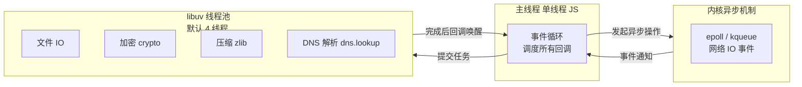
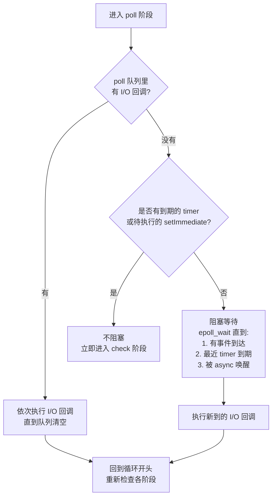
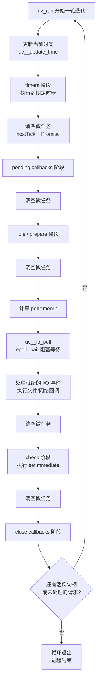
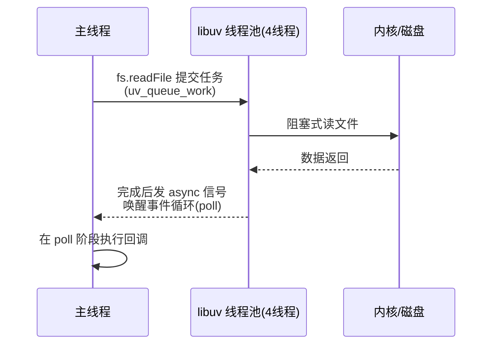

# Node.js 事件循环深度剖析：结构、顺序与原理

> 本文不讨论"怎么用 setTimeout"，而讨论"Node 凭什么用单线程撑起高并发 IO，你的异步代码到底在哪个阶段、按什么顺序执行"。
> 目标是把事件循环的六阶段结构（libuv）、微任务与 `process.nextTick` 的插入时机、线程池分工、定时器精度的真相、以及面试必考的"输出顺序题"讲透。
>
> 分析对象为 **Node.js 16+（libuv 1.4x）**，源码引用对应 `libuv` 与 Node 的 `timers` / `internal/process/task_queues` 模块。

---

## 目录

1. [全景：Node.js = V8 + libuv，一个 JS 线程 + 一个线程池](#1-全景nodejs--v8--libuv一个-js-线程--一个线程池)
2. [六阶段结构总览：事件循环的地铁环线](#2-六阶段结构总览事件循环的地铁环线)
3. [timers 阶段：定时器与最小堆](#3-timers-阶段定时器与最小堆)
4. [pending callbacks 阶段：被延迟的 I/O 回调](#4-pending-callbacks-阶段被延迟的-io-回调)
5. [idle / prepare 阶段：libuv 的后台房间](#5-idle--prepare-阶段libuv-的后台房间)
6. [poll 阶段：事件循环的心脏](#6-poll-阶段事件循环的心脏)
7. [check 阶段：setImmediate](#7-check-阶段setimmediate)
8. [close callbacks 阶段：收尾工作](#8-close-callbacks-阶段收尾工作)
9. [微任务与 process.nextTick：阶段之间的"插队者"](#9-微任务与-processnexttick阶段之间的插队者)
10. [一次完整迭代：源码级流程](#10-一次完整迭代源码级流程)
11. [四道必考输出顺序题全解析](#11-四道必考输出顺序题全解析)
12. [定时器精度的真相：0ms、1ms 与 4ms 钳制](#12-定时器精度的真相0ms1ms-与-4ms-钳制)
13. [线程池：哪些 IO 真异步，哪些走线程池](#13-线程池哪些-io-真异步哪些走线程池)
14. [事件循环如何退出：活跃句柄与请求](#14-事件循环如何退出活跃句柄与请求)
15. [浏览器 vs Node：两种事件循环对比](#15-浏览器-vs-node两种事件循环对比)
16. [阻塞与饥饿：如何拖垮事件循环](#16-阻塞与饥饿如何拖垮事件循环)
17. [常见认知误区速查表](#17-常见认知误区速查表)
18. [面试速记卡](#18-面试速记卡)

---

## 1. 全景：Node.js = V8 + libuv，一个 JS 线程 + 一个线程池

### 🎯 一句话：Node 用"单线程 JS + 多路复用内核 IO + 线程池兜底"撑起高并发

Node.js 由两大件组成：

| 组件 | 职责 |
|---|---|
| **V8** | JS 引擎：解析、编译、执行 JS，管理堆内存与 GC |
| **libuv** | 跨平台异步库：**提供事件循环**、线程池、文件/网络异步 IO、定时器、信号处理 |

关键认知：

1. **JS 代码永远跑在同一个线程**（主线程，也称"事件循环线程"）；
2. **耗时的系统操作不占用主线程**：网络 IO 交给操作系统内核的异步机制（epoll/kqueue），文件 IO / 加密 / 压缩交给 **libuv 线程池**（默认 4 个线程）；
3. 系统操作完成后，**回调被丢回事件循环**，由主线程按顺序执行。



> 所以"Node 是单线程的"这个说法**只说对了一半**：**JS 执行是单线程，但 IO 是并行/异步的**。真正单线程带来的限制是：**任何一段同步的 CPU 密集代码都会阻塞一切**。

---

## 2. 六阶段结构总览：事件循环的地铁环线

libuv 把事件循环组织成 **6 个阶段（phase）**，每轮循环按固定顺序走一圈：

```
   ┌───────────────────────────┐
┌─►│           timers          │ ← setTimeout / setInterval 到期回调
│  └─────────────┬─────────────┘
│  ┌─────────────┴─────────────┐
│  │     pending callbacks     │ ← 被延迟的 I/O 回调（如 TCP 错误）
│  └─────────────┬─────────────┘
│  ┌─────────────┴─────────────┐
│  │       idle, prepare       │ ← libuv 内部使用
│  └─────────────┬─────────────┘
│  ┌─────────────┴─────────────┐
│  │           poll            │ ← ★ 核心：等待并处理 I/O 事件
│  └─────────────┬─────────────┘
│  ┌─────────────┴─────────────┐
│  │           check           │ ← setImmediate 回调
│  └─────────────┬─────────────┘
│  ┌─────────────┴─────────────┐
│  │      close callbacks      │ ← socket.on('close') 等收尾
│  └─────────────┴─────────────┘
└──────────────────────────────┘
```

### 一张表速记

| 阶段 | 处理的回调 | 一句话本质 |
|---|---|---|
| timers | `setTimeout` / `setInterval` | "到点了" |
| pending callbacks | 某些系统级 I/O 回调 | "上一轮欠的债" |
| idle / prepare | libuv 内部任务 | "后台房间，别进来" |
| **poll** | **网络 IO、文件 IO 完成回调** | "等事件 + 处理事件" |
| check | `setImmediate` | "本轮的末班车" |
| close callbacks | `close` / `destroy` | "扫尾" |

### ⚠️ 最重要的两个规律（先记住，后面展开）

1. **微任务（Promise）和 `process.nextTick` 不属于任何阶段**——它们在阶段与阶段之间、甚至每个回调之后被"插队"清空；
2. **poll 阶段是会"阻塞等待"的唯一阶段**，其他阶段执行完就走。循环"是否要等、等多久"由 poll 计算。

---

## 3. timers 阶段：定时器与最小堆

### 3.1 定时器的组织：最小堆（Min-Heap）

libuv 用**二叉最小堆**管理所有定时器：堆顶是**到期时间最早**的定时器。插入/删除 O(logN)，取最早 O(1)。

### 3.2 本阶段做什么

1. 取出堆顶，看它的到期时间是否 ≤ 当前时间；
2. 若到期，弹出并执行回调；继续取下一个；
3. 直到堆顶未到期，**本阶段结束，进入下一阶段**。

### 3.3 三个关键认知

- **定时器不是精确的**：`setTimeout(fn, 100)` 表示"**至少 100ms 后**执行"，不保证 100ms 整触发——因为：
  1. 主线程此刻可能正在执行其他代码（回调排队）；
  2. 事件循环可能还没走到 timers 阶段；
  3. poll 阶段阻塞等待的时长会影响循环节奏。
- **到期时间从"注册时"算起**：注册后立刻开始计时，不管事件循环是否繁忙；回调只是在"最早能执行"时执行。
- **回调执行时间长 = 拖垮全局**：一个 timers 回调里跑 5 秒同步代码，后面所有阶段全部顺延。

```js
const start = Date.now();
setTimeout(() => {
  console.log('实际延迟:', Date.now() - start, 'ms');  // 通常是 1~3ms（不是 0）
}, 0);
// 同步代码块（模拟繁忙）：
for (let i = 0; i < 5e8; i++) {}   // 忙等 ~2 秒
// 输出：实际延迟: ~2000ms —— 定时器被同步代码推迟了！
```

---

## 4. pending callbacks 阶段：被延迟的 I/O 回调

- 执行**某些系统操作的回调**，最典型的是 **TCP 错误事件**（如连接被拒 `ECONNREFUSED`）。
- 为什么叫 pending：这些回调不能立即在触发它们的 poll 循环里安全调用（涉及 libuv 内部状态机），会被放进 pending 队列，**延迟到下一轮循环的此阶段执行**。
- 对业务开发者：本阶段几乎无感，但它是 libuv 内部正确性的保障。

---

## 5. idle / prepare 阶段：libuv 的后台房间

- **idle handle**：每轮循环都执行（如内部统计、`_handle` 维护）。
- **prepare handle**：在 poll 阻塞**之前**执行（Node 内部有用到，比如准备 poll 前的状态同步）。
- 业务代码**接触不到**这两个阶段，知道它们存在即可。

---

## 6. poll 阶段：事件循环的心脏

poll 是整个循环最核心、最复杂的阶段，它承担两件事：**阻塞等待事件** 和 **执行 I/O 回调**。

### 6.1 进入 poll 后做什么（决策树）



### 6.2 poll 的"阻塞时长"怎么算（关键）

libuv 计算本次 poll 等待的 `timeout`：

| 情况 | timeout | 效果 |
|---|---|---|
| 有到期 timer | 0 | 立即返回，不阻塞 |
| 有 setImmediate 待执行 | 0 | 立即返回，进 check |
| poll 队列非空 | 0 | 先处理已有回调 |
| 无以上情况 | **最近 timer 剩余时间** | 睡到 timer 到期被唤醒，循环继续 |
| 无任何活跃句柄 | 0（然后循环退出） | 见第 14 节 |

### 6.3 poll 阶段处理哪些回调

- **网络 IO**（TCP/UDP/HTTP/TLS）：epoll/kqueue 事件驱动，**真正的内核异步**；
- **文件 IO / crypto / zlib 完成回调**：线程池任务完成后，通过 `uv_async_t` 唤醒主线程，**回调也在 poll 阶段执行**（见第 13 节）；
- `setImmediate` 不在 poll 里，它在下一阶段的 check 中。

> poll 阶段执行完当前队列后，如果这时有 timer 到期了怎么办？——**回到循环开头**，由下一轮迭代的 timers 阶段处理，而不是中途插进去。

---

## 7. check 阶段：setImmediate

- 执行 `setImmediate` 注册的回调；
- 名字的由来：它在 poll **之后**（check 即"检查/收尾"），设计意图就是"**I/O 回调之后立刻跑**"；
- 对比 `setTimeout(fn, 0)`：`setImmediate` **不受 timers 阶段调度影响**，在当轮循环的 check 阶段必然执行，因此**在 I/O 回调内部，setImmediate 永远先于 setTimeout(0)**（详见第 11 节）。

---

## 8. close callbacks 阶段：收尾工作

- 处理 `close` / `destroy` 事件：如 `socket.destroy()`、`stream.destroy()` 触发；
- `socket.on('close')` 的回调在这里执行；
- 如果 socket 还连着，它的 `'close'` 事件会推迟到所有连接关闭后。

---

## 9. 微任务与 process.nextTick：阶段之间的"插队者"

这是事件循环**最容易被忽略、也是面试最刁钻**的部分。

### 9.1 三条铁律

1. **`process.nextTick` 与 Promise 微任务不属于任何阶段**，它们拥有独立的队列；
2. **每个回调（macrotask）执行完毕后**，事件循环在进入下一个回调/阶段前，会**先清空**这两条队列；
3. **清空顺序**：先 `process.nextTick` 队列，再 Promise 微任务队列（`queueMicrotask` 与 Promise 同级）。

### 9.2 队列内部结构（Node 源码视角）

```
┌────────────────────────────┐
│  nextTickQueue              │  ← process.nextTick 回调
│  (internal/process/task_queues)
├────────────────────────────┤
│  microtaskQueue             │  ← Promise.then / queueMicrotask
│  (V8 微任务队列)
└────────────────────────────┘
        ↑ 由 processTicksAndRejections() 统一清空
```

Node 在 C++ 层每次调用完一个 JS 回调后，会调用 `processTicksAndRejections()`：

```
执行下一个 macrotask 前：
  1. 清空 nextTickQueue（全部）
  2. 清空 V8 微任务队列（全部）
  3. 若 nextTick 队列又变非空（回调里又注册了 nextTick）→ 回到 1，继续清
```

### 9.3 为什么 nextTick 优先于 Promise

历史原因：`process.nextTick` 是 Node 最古老的异步原语（早于 Promise），语义是"**在当前操作结束后、立即执行**"，优先级最高早已成为约定。Promise 是 ES 标准，Node 让它排在 nextTick 之后。

### 9.4 用"电梯"比喻理解整体调度

> 事件循环是一栋楼的电梯：6 个阶段是楼层，微任务队列是**每层楼梯口的小门厅**。电梯每次停靠一个楼层（执行完一个回调/阶段），**都要先把门厅里排队的人清空**，才继续上行。而 nextTick 是门厅里"VIP 通道"，永远先走。

```js
process.nextTick(() => console.log('A: nextTick'));
Promise.resolve().then(() => console.log('B: promise'));
setImmediate(() => console.log('C: immediate'));
setTimeout(() => console.log('D: timeout'), 0);

// 输出顺序：
// A: nextTick → B: promise → C: immediate → D: timeout
// 原因：主模块执行完（本身也是一个 macrotask），先清空微任务（A、B），
//      然后本轮循环：timers 阶段无到期（D 注册于 1ms 后）→ poll 阻塞 ~1ms
//      → check 阶段执行 C → 下一轮 timers 执行 D
```

---

## 10. 一次完整迭代：源码级流程

把上面所有内容串起来，事件循环的一轮迭代（`uv_run` 一次循环体）完整流程：



**对照 Node 源码**：

```c
// deps/uv/src/unix/core.c  uv_run()
int uv_run(uv_loop_t* loop, uv_run_mode mode) {
    while (r == 0 && uv__loop_alive(loop)) {   // 还有活跃句柄就继续
        uv__update_time(loop);                 // 1. 更新时间
        uv__run_timers(loop);                  // 2. timers
        ran_pending = uv__run_pending(loop);   // 3. pending callbacks
        uv__run_idle(loop);                    // 4. idle
        uv__run_prepare(loop);                 // 5. prepare
        timeout = uv_backend_timeout(loop);    // 6. 计算 poll 超时
        uv__io_poll(loop, timeout);            // 7. ★ poll（阻塞等待+处理事件）
        uv__run_check(loop);                   // 8. check
        uv__run_closing_handles(loop);         // 9. close callbacks
        ...
    }
}
```

> 注意图中每一阶段后的"清空微任务"：**任何一个 C++ 回调返回 JS 后都会触发微任务清空**，不止阶段之间。所以微任务的插入时机其实比"阶段边界"更细——是"每次回调边界"。

---

## 11. 四道必考输出顺序题全解析

### 题 1：顶层 setTimeout vs setImmediate（结果不确定）

```js
setTimeout(() => console.log('timeout'), 0);
setImmediate(() => console.log('immediate'));
```

**答案：不确定**（两次运行可能不同）。

**原理**：进程启动 → 加载模块 → 进入事件循环。首次循环 timers 阶段检查时，`setTimeout(0)` 的定时器（最少 ~1ms 到期）可能**已到期也可能未到期**：

- 如果模块加载耗时 > 1ms（或系统繁忙）→ timers 阶段直接执行 `timeout` → **timeout 先**；
- 如果 < 1ms → timers 无到期 → poll 阻塞等到 timer 到期 → 但 poll 之后先走 check → **immediate 先**。

### 题 2：I/O 回调内 setTimeout vs setImmediate（结果确定）

```js
const fs = require('fs');
fs.readFile(__filename, () => {
  setTimeout(() => console.log('timeout'), 0);
  setImmediate(() => console.log('immediate'));
});
```

**答案：一定是 `immediate → timeout`**。

**原理**：`readFile` 回调在 **poll 阶段**执行；执行完（并清空微任务）后，poll 队列已空 → 本轮循环**直接进入 check 阶段**执行 `immediate` → 下一轮迭代 timers 阶段才轮到 `timeout`。这是最经典的"为什么 setImmediate 叫 'immediate'"。

### 题 3：nextTick vs Promise vs 同步代码

```js
console.log('sync');
process.nextTick(() => console.log('nextTick'));
Promise.resolve().then(() => console.log('promise'));

// sync → nextTick → promise
```

**原理**：同步代码立即执行；主模块执行完后清空微任务，`nextTick` 队列优先于 Promise 队列。

### 题 4：微任务可以"越级插队"吗

```js
fs.readFile(__filename, () => {
  console.log('read1');
  process.nextTick(() => console.log('tick1'));
  Promise.resolve().then(() => console.log('p1'));
});
fs.readFile(__filename, () => {
  console.log('read2');
});

// 可能的输出：read1 → tick1 → p1 → read2
// 原因：read1 这个 macrotask 执行完，先清空 nextTick（tick1）与 Promise（p1），
//       然后才轮到同一 poll 队列中的下一个回调 read2。
```

**结论：微任务不是只插在"阶段之间"，而是插在"每个回调之后"。**

---

## 12. 定时器精度的真相：0ms、1ms 与 4ms 钳制

### 12.1 `setTimeout(fn, 0)` 到底延迟多久

- 最少 **~1ms**：libuv 在 Unix 上把超时时间向上取整到毫秒级；
- 实际通常 1~3ms，取决于主线程繁忙程度与事件循环节奏；
- **所以"0ms 定时器"并不是 0ms**，它只是"尽快进入 timers 队列"。

### 12.2 4ms 钳制（Clamping）

Node 的 `timers` 模块实现了与浏览器一致的钳制规则：

- **嵌套超过 5 层**且请求延迟 < 4ms 时，最小延迟被钳制到 **4ms**；
- 目的：防止密集嵌套定时器吃满 CPU（"饿死事件循环"防御）。

```js
let count = 0;
const t = setInterval(() => {
  count++;
  if (count === 1) console.log('第 1 层: 约 1ms');
  if (count === 6) {
    console.log('第 6 层: 被钳制到约 4ms');
    clearInterval(t);
  }
}, 0);
```

### 12.3 `setTimeout` vs `setImmediate` 如何选

| 诉求 | 选择 |
|---|---|
| 希望"下一轮事件循环最早时机"执行 | `setImmediate`（check 阶段，本轮必有） |
| 有明确延迟语义（如 1000ms） | `setTimeout` |
| 在 I/O 回调里安排后续任务 | 优先 `setImmediate`（不受 timers 阶段拖累） |

---

## 13. 线程池：哪些 IO 真异步，哪些走线程池

### 13.1 两类"异步"的本质区别

| 类别 | 机制 | 例子 | 线程池占用 |
|---|---|---|---|
| **内核级异步** | epoll/kqueue 事件驱动，**不占线程** | TCP/UDP/HTTP、TLS、`dns.resolve*`（c-ares） | ❌ |
| **线程池异步** | 系统调用本身阻塞，丢给 **libuv 线程池**（默认 4 线程） | 文件 IO、`crypto`（pbkdf2/scrypt）、`zlib`、`dns.lookup` | ✅ |

> 注意：**普通文件 IO 在 Linux/Unix 上是同步系统调用**（`pread` 等会阻塞），所以必须丢线程池；网络 IO 才有真正的内核异步（epoll）。

### 13.2 线程池的工作流程



### 13.3 线程池耗尽的经典问题

```js
const fs = require('fs');
// 默认 4 个线程，一次提交 8 个文件读取：
for (let i = 0; i < 8; i++) {
  fs.readFile('big.txt', () => console.log('done', i));
}
// 前 4 个立即执行，后 4 个排队 —— 全部完成时间翻倍
```

- 调大：`UV_THREADPOOL_SIZE=8 node app.js`（或 `process.env.UV_THREADPOOL_SIZE`）；
- 调大后的风险：线程池线程数过多 → 上下文切换开销、内存（每线程默认栈 4MB 左右）；
- **判断一个操作是否占线程池**：官方文档列出的 API 用户为 fs、crypto、zlib、dns.lookup（以及部分 child_process 内部操作）。

### 13.4 线程池 vs Worker Threads（别混淆）

| | libuv 线程池 | worker_threads |
|---|---|---|
| 目的 | 跑阻塞的系统调用（IO/加密/压缩） | 跑**你的 JS 业务代码**（CPU 密集计算） |
| 通信 | 内部完成回调，无需你管理 | `postMessage` / SharedArrayBuffer |
| 默认 | 4 线程，自动管理 | 不默认启用，需手动创建 |
| 场景 | 异步 IO | 计算密集任务（图像处理、解析大 JSON） |

> CPU 密集型业务（如大数组排序、正则回溯）**不会**自动走线程池——它们直接阻塞主线程。要并行计算，用 `worker_threads` 或拆成异步批次。

---

## 14. 事件循环如何退出：活跃句柄与请求

### 14.1 循环不退出的条件

`uv__loop_alive(loop)` 返回 true 当且仅当存在**活跃句柄（handle）或未完成的请求（request）**：

| 让循环保持活跃的常见对象 | 类型 |
|---|---|
| 未清除的 `setTimeout` / `setInterval` | timer handle |
| 监听中的 `http.Server` / TCP socket | I/O handle |
| 未执行的 `setImmediate` | check handle |
| 进行中的异步 IO（fs/http 请求） | request |

### 14.2 常见现象

- **`server.listen()` 后进程不退出**：这是预期行为（保持活跃的 I/O handle）；
- **`process.exit()` 强制退出**：跳过收尾，不执行 close 回调；
- **`server.close()` 不生效**：因为还有未关闭的连接/定时器，需要先清理；
- **无限循环 `while(true){}` 不退出也不响应**：事件循环根本没机会运行。

```js
// 为什么下面的进程"卡住"？
const timer = setInterval(() => {}, 1000);   // 活跃 timer handle
// 要退出：clearInterval(timer)
```

---

## 15. 浏览器 vs Node：两种事件循环对比

### 15.1 浏览器的事件循环（简化模型）

```
执行一个宏任务 (script / setTimeout / 事件回调 / 渲染)
   ↓
清空微任务队列 (Promise / MutationObserver / queueMicrotask)
   ↓
（需要时）渲染页面 / 执行 requestAnimationFrame
   ↓
取下一个宏任务……
```

- 宏任务：`<script>`、事件回调、`setTimeout`、`MessageChannel`、UI 渲染；
- 微任务：Promise、`MutationObserver`、`queueMicrotask`；
- **渲染时机**：微任务清空后、下一个宏任务前（`requestAnimationFrame` 在这一带）。

### 15.2 对比表

| 维度 | 浏览器 | Node.js |
|---|---|---|
| 宏任务组织 | 单一任务队列（按优先级取） | **6 个固定阶段**（timers→…→close） |
| 微任务清空时机 | 每个宏任务后 | 每个宏任务回调后（更频繁） |
| `nextTick` | ❌ 没有 | ✅ 优先级最高的队列 |
| 渲染 / rAF | ✅ 每轮宏任务后可能渲染 | ❌ 无渲染概念 |
| 任务来源 | DOM/网络/用户事件 | 内核 IO + 线程池 |
| 定时器钳制 | 嵌套 5 层后最小 4ms | 同样实现 |

### 15.3 最重要的共性

**"宏任务之间夹微任务"这个模型是共通的**。区别只是：Node 把宏任务细分成了 6 个阶段，且多了 `process.nextTick`。

---

## 16. 阻塞与饥饿：如何拖垮事件循环

### 16.1 两类致命代码

**类型一：同步 CPU 密集（阻塞）**

```js
const crypto = require('crypto');
app.get('/hash', (req, res) => {
  // 同步计算 10 万次哈希 → 阻塞主线程数秒 → 所有用户全部卡住
  for (let i = 0; i < 100000; i++) crypto.createHash('sha256').update('x').digest();
  res.send('done');
});
```

正解：
1. 改用异步 API：`crypto.pbkdf2` / `scrypt`（自动走线程池）；
2. 或丢给 `worker_threads` 并行计算；
3. 或分批 + `setImmediate` 让出事件循环。

**类型二：微任务递归（饥饿）**

```js
// 灾难示例：nextTick 无限递归 → 主线程永远在清空 nextTick 队列 → I/O 全部饿死
function loop() {
  process.nextTick(loop);
}
loop();
```

正解：避免在微任务里递归做大量工作；需要"循环异步处理"时用 `setImmediate` 或分批。

### 16.2 三句话定位性能问题

```
卡顿发生时：
 1. 有 CPU 密集同步代码在跑？ → 挪线程池 / worker_threads / 分批
 2. 有超长回调（如大 JSON 解析、正则回溯）？ → 拆任务 / 加超时保护
 3. 事件循环忙到没机会 poll？ → 用 setImmediate 让出，别用微任务递归
```

---

## 17. 常见认知误区速查表

| # | 误区 | 真相 |
|---|---|---|
| 1 | `setTimeout(fn, 0)` 会立即执行 | 最少 ~1ms，且要等事件循环走到 timers 阶段；同步代码先跑完 |
| 2 | "Node 是单线程的" | **JS 执行单线程**，但 libuv 线程池（默认 4）并行处理 IO/加密/压缩 |
| 3 | 所有异步 IO 都不占线程池 | 网络 IO 走 epoll 不占线程；**文件 IO、crypto、zlib、dns.lookup 走线程池** |
| 4 | `setImmediate` 永远比 `setTimeout(0)` 快 | 只在 **I/O 回调内**确定；顶层两者顺序不确定 |
| 5 | `process.nextTick` 和 Promise 是同一个队列 | 两条独立队列，**nextTick 先清空**，优先级更高 |
| 6 | 微任务只在"阶段之间"执行 | 在**每个 macrotask 回调之后**都会清空 |
| 7 | Promise 回调也会阻塞事件循环 | 微任务回调本身是 JS 代码，CPU 密集照样阻塞主线程 |
| 8 | `setTimeout(1000)` 保证 1 秒触发 | 只保证**不早于** 1 秒，主线程繁忙会推迟 |
| 9 | 定时器是精确的链表/红黑树 | libuv 用**最小堆**管理 |
| 10 | 事件循环是 V8 实现的 | 是 **libuv** 实现的，V8 只负责执行 JS |
| 11 | CPU 密集任务会自动分发到线程池 | 不会！除非用异步 API（内部走线程池）或 worker_threads |
| 12 | `while(true){}` 只是"卡住当前函数" | 会让**整个进程**失去响应（事件循环永远没机会运行） |
| 13 | 一个慢的 fs 回调只影响它自己 | 会阻塞同一轮 poll 队列里所有后续回调 |
| 14 | 嵌套 `setTimeout` 延迟固定 | 嵌套超过 5 层且 <4ms 会被**钳制到 4ms** |
| 15 | worker_threads 和线程池是同一个东西 | 线程池跑系统调用；worker_threads 跑你的 JS 业务代码 |
| 16 | `server.close()` 后进程立刻退出 | 还有活跃连接/timer 时不会退出，需清完句柄 |

---

## 18. 面试速记卡

### 六阶段顺序（倒背如流）

> **timers → pending callbacks → idle/prepare → poll → check → close callbacks**

中文口诀：**"到点（timers）→ 补债（pending）→ 后台（idle/prepare）→ 等待（poll）→ 末班（check）→ 扫尾（close）"**

### 五个必答知识点

1. **poll 是唯一会阻塞等待的阶段**，等待时长由"最近 timer 剩余时间"决定；
2. **微任务在每次回调后清空**，顺序永远是 nextTick → Promise；
3. **I/O 回调内 setImmediate 一定先于 setTimeout(0)**（poll → check → 下一轮 timers）；
4. **顶层 setTimeout(0) vs setImmediate 顺序不确定**（取决于首次循环时 timer 是否已到期）；
5. **线程池默认 4 线程**，文件 IO/crypto/zlib/dns.lookup 会排队，`UV_THREADPOOL_SIZE` 可调。

### 一句话总结

> **"Node 用单线程 JS 跑逻辑、用内核异步处理网络、用线程池兜底阻塞 IO、用微任务插队保证连续性——事件循环就是把这些碎片按固定时序拼起来的调度器，所有回调都在这条轨道上排队，任何一段同步重活都会让整条轨道堵车。"**
