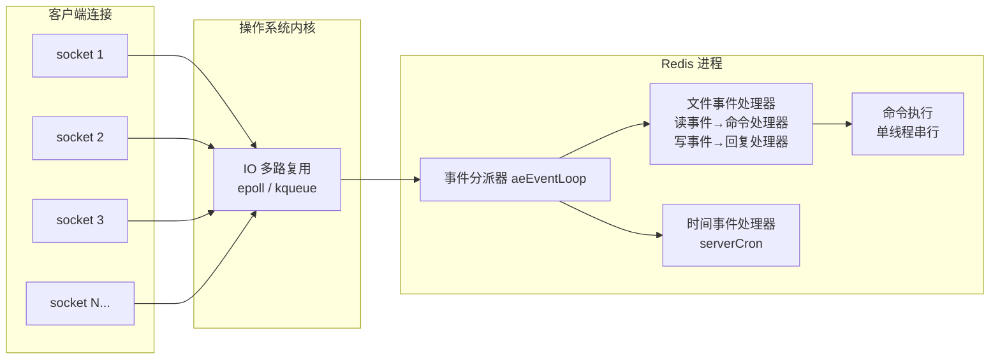
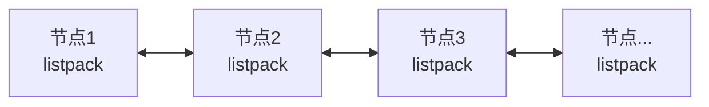
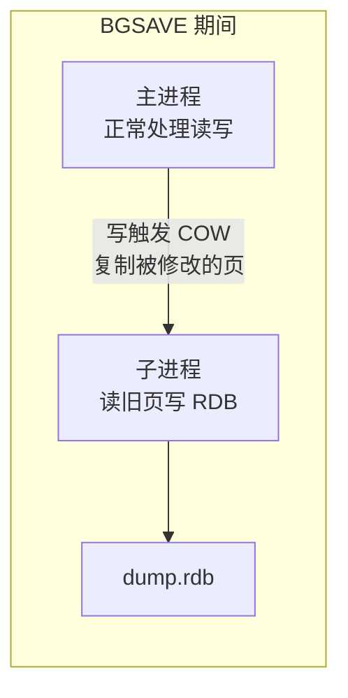
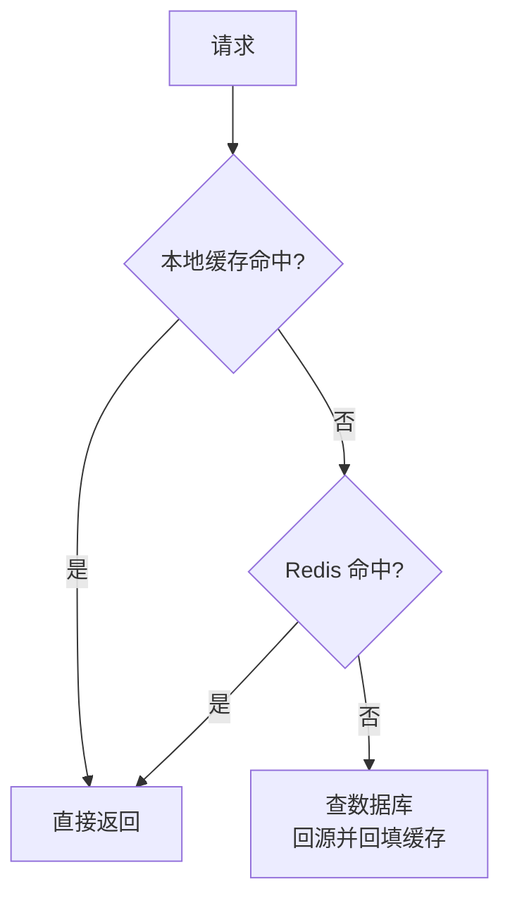
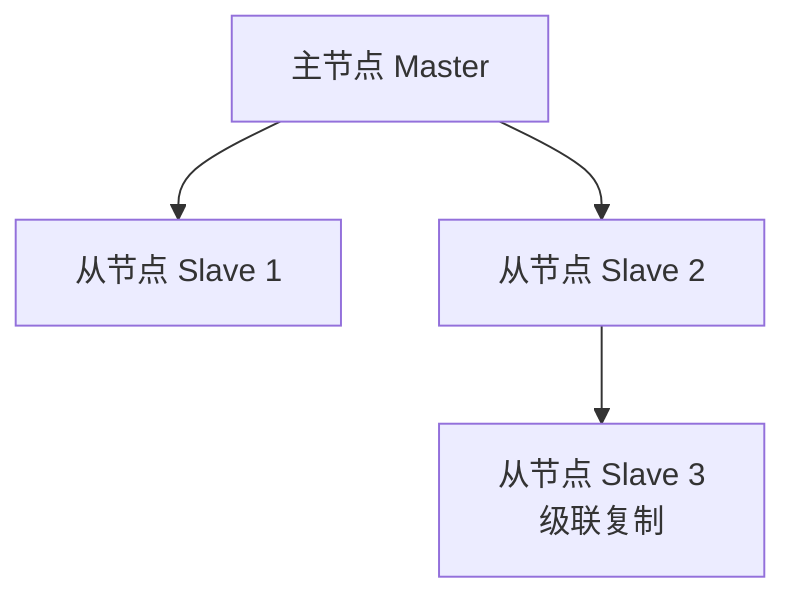
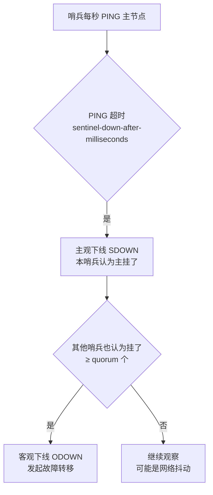
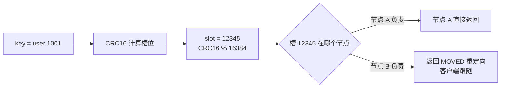
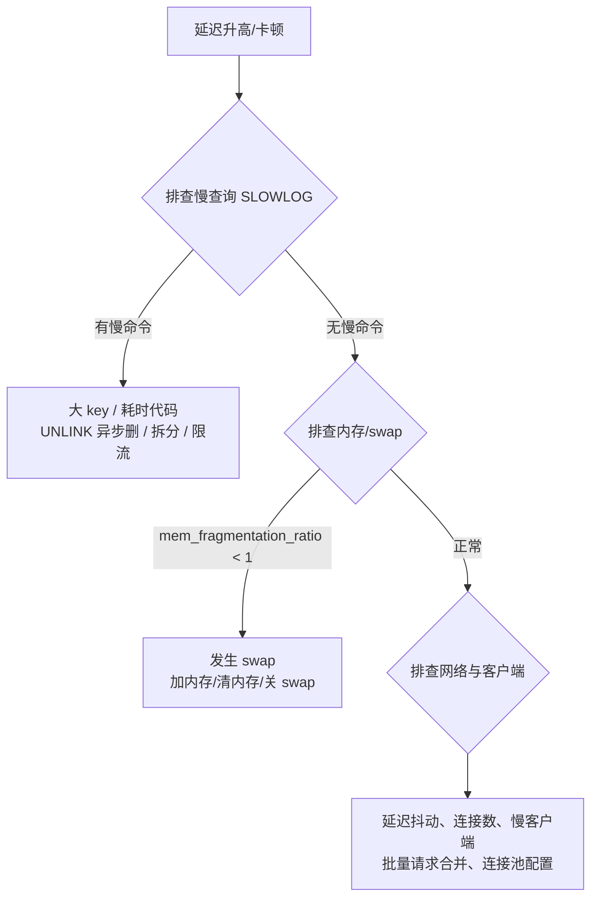

# Redis 深度剖析：单线程的底气、数据结构与高可用

> 本文不讨论"怎么敲命令"，而讨论"为什么 Redis 能这么快、数据到底怎么存的、挂了怎么办"。
> 目标是把 Redis 的整体架构（单线程事件循环）、底层数据结构（SDS/dict/跳表/listpack）、持久化（RDB/AOF）、高可用（主从/哨兵/集群）、以及缓存一致性难题讲清楚。
>
> 分析对象为 **Redis 5.x ~ 7.x**（版本差异会单独注明），以单机版 + 集群版为主线。

---

## 目录

1. [整体架构：单线程事件循环如何撑起 10w+ QPS](#1-整体架构单线程事件循环如何撑起-10w-qps)
2. [为什么 Redis 这么快：四层原因](#2-为什么-redis-这么快四层原因)
3. [五大数据类型总览：接口与编码](#3-五大数据类型总览接口与编码)
4. [底层结构之一：SDS 动态字符串](#4-底层结构之一sds-动态字符串)
5. [底层结构之二：dict 字典与渐进式 rehash](#5-底层结构之二dict-字典与渐进式-rehash)
6. [底层结构之三：跳表 skiplist](#6-底层结构之三跳表-skiplist)
7. [底层结构之四：intset / listpack / quicklist](#7-底层结构之四intset--listpack--quicklist)
8. [六大使用场景与命令设计](#8-六大使用场景与命令设计)
9. [持久化之一：RDB 快照与 COW](#9-持久化之一rdb-快照与-cow)
10. [持久化之二：AOF 与重写](#10-持久化之二aof-与重写)
11. [持久化之三：混合持久化与选型](#11-持久化之三混合持久化与选型)
12. [过期删除策略：惰性 + 定期](#12-过期删除策略惰性--定期)
13. [内存淘汰策略：8 种策略与 LRU/LFU](#13-内存淘汰策略8-种策略与-lrulfu)
14. [缓存三大问题：穿透、击穿、雪崩](#14-缓存三大问题穿透击穿雪崩)
15. [缓存与数据库一致性](#15-缓存与数据库一致性)
16. [主从复制：全量复制与增量复制](#16-主从复制全量复制与增量复制)
17. [哨兵 Sentinel：自动故障转移](#17-哨兵-sentinel自动故障转移)
18. [Redis Cluster：16384 个槽的分片世界](#18-redis-cluster16384-个槽的分片世界)
19. [事务与 Lua 脚本](#19-事务与-lua-脚本)
20. [消息队列：Pub/Sub 与 Stream](#20-消息队列pubsub-与-stream)
21. [性能排查：大 key、慢查询、延迟监控](#21-性能排查大-key慢查询延迟监控)
22. [常见认知误区速查表](#22-常见认知误区速查表)
23. [命令速查](#23-命令速查)

---

## 1. 整体架构：单线程事件循环如何撑起 10w+ QPS

### 🎯 一句话：Redis 是"单线程执行命令 + 多路复用 IO"的典型代表

Redis 的**命令执行是单线程的**，但单线程不等于慢——它靠**非阻塞 IO + 事件循环**把 CPU 利用率拉满，单实例 QPS 可达 10 万+。



### 1.1 事件循环：Redis 的心脏（aeEventLoop）

Redis 内部运行一个事件循环，处理两类事件：

1. **文件事件（File Event）**：即 socket 上的可读/可写事件，是处理客户端命令的主通道。
2. **时间事件（Time Event）**：周期性任务，最核心的是 **serverCron**（默认每 100ms 执行一次），负责：
   - 清理过期 key（主动删除的一部分）；
   - 触发 RDB/AOF 持久化；
   - 主从重连、复制心跳；
   - 更新内存统计、集群状态等。

文件事件处理流程（一次循环）：

```
epoll_wait 等待事件
   ↓ 有 socket 可读
读取请求 → 解析协议（RESP）→ 查命令表 → 执行命令（单线程）→ 将回复写入输出缓冲区
   ↓ socket 可写
把输出缓冲区的数据写回客户端（非阻塞，写不完下次再写）
```

### 1.2 单线程的关键内涵

- **"单线程"指命令执行与数据操作是单线程的**：任何时刻只有一个命令在被执行，天然串行，**不需要锁、没有上下文切换、没有并发竞争**。
- 但 **Redis 6.0+ 引入了多线程 IO**：网络读写（解析请求、发送回复）可交给多个 IO 线程，命令执行仍是单线程。默认 `io-threads` 关闭，官方建议 4 核以上机器开 3~4 个 IO 线程。
- 从 **Redis 7.0 开始**，部分后台任务（如 AOF 刷盘）也可以在专用线程中执行（`bio` 线程一直都有，负责异步删除、刷盘等）。

### 1.3 为什么单线程反而是优势

| 维度 | 多线程模型的问题 | Redis 单线程的好处 |
|---|---|---|
| 锁竞争 | 高并发下锁开销大 | 无锁，无死锁 |
| 上下文切换 | 线程切换消耗 CPU | 零切换 |
| 复杂度 | 并发 bug 多、调试难 | 逻辑简单、行为可预测 |
| 性能下限 | 受线程调度影响 | 稳定可预测的延迟 |

**代价**：所有命令串行执行 → 一个慢命令会阻塞所有后续请求（这正是大 key、`KEYS` 命令是生产禁忌的原因）。

---

## 2. 为什么 Redis 这么快：四层原因

1. **数据在内存**：读写内存（纳秒级）远快于磁盘（毫秒级），这是最根本的原因。
2. **高效的数据结构**：`O(1)` 的 dict、`O(logN)` 的跳表、紧凑的 listpack——避免了大范围扫描。
3. **IO 多路复用 + 非阻塞 IO**：一个线程可以同时监听成千上万个 socket，用 epoll 高效通知"哪个 socket 就绪了"，而不是每连接一个线程。
4. **单线程避免竞争**：无锁、无上下文切换，CPU 时间全部花在业务上。

> 补充：Redis 是 **C 语言**实现、协议极简（RESP）、回复批量写（输出缓冲合并），这些工程细节也贡献了吞吐量。

---

## 3. 五大数据类型总览：接口与编码

### 3.1 类型 vs 编码：两层设计

用户看到的是 **5 种数据类型**（String / List / Hash / Set / ZSet），底层 Redis 会根据数据特征**自动选择内部编码（encoding）**，用更省内存的方式存储：

| 数据类型 | 内部编码（小数据→大数据） | 转换触发条件 |
|---|---|---|
| String | `int` → `embstr` → `raw` | 整数存 8 字节 long；≤44 字节短串用 embstr；更长用 raw |
| List | `quicklist`（3.2+，由 listpack 节点组成） | 一直用 quicklist |
| Hash | `listpack`（7.0 前为 ziplist）→ `hashtable` | 字段数 > 128 或字段值 > 64 字节 |
| Set | `intset` → `hashtable` | 全为整数且 ≤512 个用 intset |
| ZSet | `listpack`（7.0 前为 ziplist）→ `skiplist` | 元素数 > 128 或成员长度 > 64 字节 |

查看编码：`OBJECT ENCODING key`

```
127.0.0.1:6379> SET num 1
OK
127.0.0.1:6379> OBJECT ENCODING num
"int"

127.0.0.1:6379> SET str "hello"
OK
127.0.0.1:6379> OBJECT ENCODING str
"embstr"
```

### 3.2 一张表看懂五大类型

| 类型 | 本质 | 底层结构 | 典型命令 | 使用场景 |
|---|---|---|---|---|
| String | 字符串/数字 | SDS | `SET/GET/INCR/SETNX` | 缓存、计数器、分布式锁、限流 |
| List | 有序可重复列表 | quicklist | `LPUSH/RPOP/LRANGE` | 消息队列（轻量）、时间线 |
| Hash | 字段-值映射 | listpack/hashtable | `HSET/HGET/HGETALL` | 对象存储（用户、商品信息） |
| Set | 无序唯一集合 | intset/hashtable | `SADD/SISMEMBER/SINTER` | 标签、共同好友、去重 |
| ZSet | 有序唯一集合 | listpack/skiplist | `ZADD/ZRANGE/ZSCORE` | 排行榜、延迟队列、限流滑动窗口 |

### 3.3 String 的三种编码细节

- **int**：整数字符串（如 `"123"`）直接以 8 字节 long 存储，`INCR/DECR` 就是整数运算，极快。
- **embstr**：字符串长度 **≤ 44 字节**时，SDS 头和字符串数据**一次性连续分配**（一次 malloc），缓存友好；但 **embstr 只读**——一旦修改，自动转 raw。
- **raw**：长度 > 44 字节，SDS 头和数据分两次分配。

> 44 这个数字怎么来的：Redis 默认内存分配 64 字节，减去 SDS 头（8 字节）+ `\0` 结尾（1 字节）+ redisObject 头（16 字节）≈ 44。

---

## 4. 底层结构之一：SDS 动态字符串

C 语言字符串（`char*`）有三个致命问题：取长度要 O(N) 遍历、`\0` 截断导致二进制不安全、拼接要手动管理内存。**SDS（Simple Dynamic String）** 解决了全部三个问题。

### 4.1 结构

```c
struct sdshdr8 {          // 还有 sdshdr5/16/32/64，按长度分级省内存
    uint8_t len;          // 已用长度（O(1) 获取 strlen）
    uint8_t alloc;        // 分配容量
    unsigned char flags;  // 类型标记
    char buf[];           // 字节数组（以 \0 结尾，兼容 C 函数）
};
```

### 4.2 三大优势

1. **O(1) 取长度**：`len` 字段直接记录，不用遍历。
2. **二进制安全**：数据按 `len` 判断边界，**不依赖 `\0` 结尾**，可以存任意二进制（图片、序列化对象）。
3. **空间预分配 + 惰性释放**：
   - 扩容时：`len < 1MB` → 预分配 2 倍空间；`len ≥ 1MB` → 预分配 +1MB。减少 realloc 次数。
   - 缩容时：不立即释放内存，先记在 `alloc` 里，避免频繁分配。

---

## 5. 底层结构之二：dict 字典与渐进式 rehash

Hash、Set、ZSet 以及**整个键空间**（所有 key → value 的映射）都依赖 dict。

### 5.1 结构

```c
typedef struct dict {
    dictType *type;
    dictht ht[2];          // 两张哈希表：ht[0] 正常用，ht[1] 扩容/缩容时用
    long rehashidx;        // rehash 进度，-1 表示不在 rehash
    ...
} dict;
```

- 哈希冲突解决：**链地址法**（每个桶挂一个链表）。
- 每个 entry 是 `key → value` 的键值对，key 是 SDS（或整数），value 是 redisObject 指针。

### 5.2 渐进式 rehash（重点）

当负载因子过高/过低时，dict 需要扩容/缩容。**rehash 不是一次性做完的**，而是"边用边搬"：

1. 为 `ht[1]` 分配新空间（约为当前已用空间 2 倍，取 2 的幂）；
2. `rehashidx` 从 0 开始，**每次增删改查顺带搬一个桶**（把 ht[0] 的桶链表搬进 ht[1]）；
3. 全部搬完，`rehashidx = -1`，释放 ht[0]，交换 ht[0]/ht[1]。

```mermaid
flowchart LR
    subgraph 阶段一[rehash 进行中]
        H0[ht[0] 旧表<br/>已搬桶 绿色 / 未搬桶 蓝色]
        H1[ht[1] 新表<br/>接收搬迁数据]
    end
    H0 -- 每次操作顺带搬一个桶 --> H1
```

**为什么渐进式**：如果一次性 rehash，几百万个 key 的大 dict 会阻塞主线程数百毫秒——这是单线程模型下不可接受的。

触发条件：
- **扩容**：负载因子 ≥ 1（无子进程）或 ≥ 5（有 BGSAVE/BGREWRITEAOF 子进程时，避免内存翻倍峰值）；
- **缩容**：负载因子 < 0.1。

---

## 6. 底层结构之三：跳表 skiplist

ZSet 的排序能力来自跳表。**跳表 = 有序链表 + 多级索引**，用随机化实现"折半查找"的效果。

### 6.1 结构

```c
typedef struct zskiplistNode {
    sds ele;                  // 成员（member）
    double score;             // 分值
    struct zskiplistNode *backward;  // 后向指针（便于倒序）
    struct zskiplistLevel {
        struct zskiplistNode *forward;  // 前向指针
        unsigned long span;             // 跨度：到下一个节点的步数（用于排名计算）
    } level[];                // 多层索引
} zskiplistNode;
```

- 每个新节点随机生成层数：**p = 1/4**，最大 **32 层**。
- 查找/插入/删除复杂度：**O(logN)**。
- 跳跃表天然有序，支持**范围查询**（`ZRANGEBYSCORE`）和 **排名**（`ZRANK`，靠 span 累加）。

### 6.2 为什么 ZSet 用跳表而不是红黑树/平衡树

| 对比 | 跳表 | 红黑树 |
|---|---|---|
| 实现复杂度 | 简单，易调试 | 复杂（旋转/变色） |
| 范围查询 | **天然支持**（有序链表遍历） | 需要中序遍历，繁琐 |
| 内存 | 每个节点平均 1/(1-p)=1.33 层索引 | 每个节点 2 个指针 |
| 并发/局部性 | 一般 | 更好（缓存局部性） |

Redis 作者的选择理由很务实：**实现简单、可读性好、范围操作方便**，性能与红黑树同级。

### 6.3 ZSet = dict + 跳表（双结构）

- **dict**：`member → score` 映射，保证 `ZSCORE` O(1)；
- **跳表**：按 `(score, member)` 排序，保证范围查询和排名。

> 空间换时间：同一份数据在内存里存两份（dict + 跳表），换取两个方向的 O(1)/O(logN) 操作。

---

## 7. 底层结构之四：intset / listpack / quicklist

### 7.1 intset：整数集合

- 所有元素为整数且数量 ≤ 512（`set-max-intset-entries`）时，Set 用 intset：**有序、紧凑的整数数组**，二分查找，内存占用极小。
- 一旦插入非整数或超过 512 个，**自动升级为 hashtable**（不可逆）。

### 7.2 listpack：紧凑列表（7.0 全面替代 ziplist）

ziplist 是 Redis 3.2 前的主力紧凑结构，但存在**连锁更新（cascade update）**问题：中间某个 entry 变大/变小，可能导致后续所有 entry 的 prevlen 字段连锁调整，最坏 O(N²)。

**listpack（7.0 起全面替换 ziplist）**通过**不记录前一个 entry 的长度**（只记录自己的长度），彻底消除了连锁更新，同时保持紧凑。

- 适用：Hash/ZSet 元素少（≤128 个，值 ≤64 字节）时用 listpack；
- 特点：连续内存、遍历 O(N)、内存占用极低、CPU 缓存友好。

### 7.3 quicklist：List 的最终形态（3.2+）

List 既要有"两端操作 O(1)"（链表），又要"内存紧凑"（压缩列表），于是 Redis 用 **quicklist = 双向链表 + 每节点一个 listpack**：



- 每个节点默认最多 128 个元素（`list-max-listpack-size`）；
- 支持中间节点压缩（`list-compress-depth`，两端 N 个节点不压缩，中间压缩）——用 CPU 换内存；
- 两端操作 O(1)，中间操作 O(N)（List 的定位本来就不是随机访问）。

---

## 8. 六大使用场景与命令设计

### 8.1 缓存（最核心）

```sql
SET user:1001 '{"name":"kela"}' EX 3600    -- 带过期时间
GET user:1001
```

### 8.2 计数器 / 限流

```sql
INCR page:view:20240801          -- 阅读量
-- 滑动窗口限流（ZSet，5.0+ 可用 Stream 或 Lua 更优雅）
ZADD limit:user:1 (timestamp) (request_id)
ZREMRANGEBYSCORE limit:user:1 0 (now - 60s)
ZCARD limit:user:1               -- 60 秒内请求数
```

### 8.3 分布式锁（Redlock 的朴素版）

```sql
SET lock:order:1001 uuid NX EX 10   -- NX：不存在才设置；EX：10 秒自动释放
-- 释放用 Lua 保证原子性（先校验持有者再 DEL）
if redis.call('get', KEYS[1]) == ARGV[1] then return redis.call('del', KEYS[1]) else return 0 end
```

> 注意：单机版可用的锁，多主 Redlock 有争议（时钟漂移、可用性 vs 安全性），工程上多数场景用单主 + 看门狗续期即可。

### 8.4 排行榜

```sql
ZADD leaderboard 1000 "playerA"
ZADD leaderboard 850  "playerB"
ZREVRANGE leaderboard 0 9 WITHSCORES   -- Top10
ZINCRBY leaderboard 50 "playerA"       -- 加分
```

### 8.5 轻量消息队列

```sql
LPUSH mq:order task_json
BRPOP mq:order 0        -- 阻塞式消费，0=永不超时
```

### 8.6 去重 / 集合运算

```sql
SADD tag:user:1 "java" "redis"
SADD tag:user:2 "java" "go"
SINTER tag:user:1 tag:user:2           -- 共同兴趣
```

---

## 9. 持久化之一：RDB 快照与 COW

### 9.1 RDB 是什么

RDB 是 Redis 的**全量快照**：把某一时刻的所有数据序列化写入一个二进制文件（`dump.rdb`），文件紧凑、加载快。

### 9.2 触发方式

```sql
SAVE                 -- 同步阻塞式保存（生产禁用）
BGSAVE               -- 异步：fork 子进程保存
CONFIG SET save "900 1 300 10 60 10000"   -- 自动触发：900 秒内 1 次写 / 300 秒内 10 次写 / 60 秒内 1 万次写
```

### 9.3 fork + Copy-On-Write（重点原理）

`BGSAVE` 的原理是 **fork 子进程 + 写时复制（COW）**：

1. 主进程 `fork()` 出子进程，**子进程共享主进程的内存页**（fork 时只复制页表，不复制数据，很快）；
2. 子进程把共享内存中的数据写入 RDB 文件；
3. 期间主进程照常服务：
   - **读**：直接读共享页，无影响；
   - **写**：触发 COW——把被写的页**复制一份**给主进程修改，子进程仍读旧页，保证快照一致性。



### 9.4 RDB 的优缺点

| 优点 | 缺点 |
|---|---|
| 文件小、加载快（恢复首选） | **可能丢数据**：两次快照之间的写入会丢失 |
| 适合备份、容灾、主从全量同步 | fork 大内存实例时有短暂阻塞（页表复制 + COW 内存峰值） |

> fork 大内存（如 20GB）时：fork 本身要复制页表（约 10ms~秒级），COW 可能导致内存峰值翻倍。所以**大内存机器要控制 RDB 频率**。

---

## 10. 持久化之二：AOF 与重写

### 10.1 AOF 是什么

**Append Only File**：把**每条写命令**追加到日志文件（`appendonly.aof`），重启时重放命令恢复数据。相当于"操作日志"。

### 10.2 刷盘策略（fsync 时机）

| `appendfsync` | 刷盘时机 | 安全性 | 性能 |
|---|---|---|---|
| `always` | 每条命令都 fsync | 最多丢 0 条 | 最慢 |
| `everysec`（默认） | 每秒批量 fsync | 最多丢 1 秒数据 | 好 |
| `no` | 交给 OS 决定 | 可能丢更多 | 最快 |

### 10.3 AOF 重写（Rewrite）

问题：AOF 无限追加会越来越大（比如对一个 key 反复 SET 100 次，日志里有 100 条）。**重写**用当前数据集生成最小命令集（`BGREWRITEAOF`）：

1. fork 子进程，基于**当前内存数据**生成新的 AOF；
2. 重写期间的写命令记录在缓冲区，重写完成后追加进新文件；
3. 原子替换旧 AOF。

> 重写与 RDB 一样基于 fork+COW，所以**重写时同样有内存峰值风险**。

### 10.4 Redis 7.0 的多部分 AOF（MP-AOF）

7.0 起 AOF 拆分为多文件 + 清单（manifest）管理，重写不再需要"合并后替换"，避免旧版 AOF 重写时磁盘写满/损坏的风险，安全性更强。

---

## 11. 持久化之三：混合持久化与选型

### 11.1 混合持久化（4.0+）

`aof-use-rdb-preamble yes`：AOF 重写时，**前半部分用 RDB 二进制快照，后半部分追加增量命令**。

- 加载速度接近 RDB（快照部分直接载入）；
- 丢失窗口接近 AOF（重写之后的命令一条不丢）。

### 11.2 选型建议

| 场景 | 推荐 |
|---|---|
| 纯缓存（可容忍重启丢数据） | 关持久化，或 RDB 低频 |
| 数据重要（订单/会话等） | **RDB + AOF 混合**（`everysec`） |
| 追求恢复速度 | RDB 优先 |
| 追求丢数据最少 | AOF（`everysec`/`always`） |

> 实践真理：**生产环境默认"RDB + AOF everysec + 混合持久化"**，备份策略另做（每日 RDB 异地备份 + 定期演练恢复）。

---

## 12. 过期删除策略：惰性 + 定期

Redis 对带 `EX/TTL` 的 key 采用**两种策略组合**：

### 12.1 惰性删除（Lazy）

- 访问 key 时检查是否过期，过期则删除并返回 nil。
- 优点：省 CPU，只在访问时清理；
- 缺点：**过期 key 若一直不被访问，会一直占内存**。

### 12.2 定期删除（Active）

- serverCron 周期性（默认每 100ms）随机抽取一部分**设置了过期时间的 key** 检查删除：
  - 默认每次抽查 20 个；
  - 如果过期比例超过 25%，继续抽查（可配置频率 `hz`，默认 10）；
- 优点：主动清理，不依赖访问；
- 缺点：**不会把所有过期 key 立刻清完**（避免阻塞主线程）。

### 12.3 重要结论

**过期的 key 不一定立即消失**，内存可能短暂"虚高"。所以：

- 判断 key 是否存在用 `EXISTS`，而不是 `GET` 是否为 nil 之外再猜；
- 大量 key 同时过期会带来**缓存雪崩**隐患（见第 14 节）；
- 真正内存不够时，靠的是**内存淘汰策略**（第 13 节），两者是不同机制。

---

## 13. 内存淘汰策略：8 种策略与 LRU/LFU

### 13.1 配置

```
maxmemory 4gb          # 内存上限（默认不设 = 无上限）
maxmemory-policy allkeys-lru
```

### 13.2 8 种策略一览

| 策略 | 作用域 | 行为 |
|---|---|---|
| `noeviction`（默认） | — | 内存满时写命令直接报错（读不受影响） |
| `allkeys-lru` | 全部 key | 淘汰**最近最少使用**的 key |
| `allkeys-lfu`（4.0+） | 全部 key | 淘汰**最不经常使用**的 key |
| `allkeys-random` | 全部 key | 随机淘汰 |
| `volatile-lru` | 设了过期的 key | 在过期 key 中淘汰 LRU |
| `volatile-lfu` | 设了过期的 key | 在过期 key 中淘汰 LFU |
| `volatile-random` | 设了过期的 key | 在过期 key 中随机淘汰 |
| `volatile-ttl` | 设了过期的 key | 淘汰剩余 TTL 最短的 key |

> 面试一句话：**"allkeys 系列对全体 key 动手，volatile 系列只对设了过期时间的 key 动手；生产缓存场景常用 allkeys-lru 或 allkeys-lfu。"**

### 13.3 近似 LRU / LFU 的实现

- 真正精确的 LRU 需要维护全量访问时间并排序，成本高。
- Redis 用**近似 LRU**：每个 key 记录一个 24 位的时间戳，淘汰时**随机采样 `maxmemory-samples`（默认 5）个 key，淘汰其中"最久没访问"的**。
- 近似 LRU 在样本数足够时，命中率逼近真实 LRU。
- **LFU（4.0+）**：记录访问频率（8 位计数器 + 衰减因子），适合"热点 key 长期访问"的场景（如缓存新闻热点），比 LRU 更能抵抗"偶发访问污染"。

---

## 14. 缓存三大问题：穿透、击穿、雪崩

这是缓存工程化的必考题，三者都是"缓存没挡住请求"的表现。

### 14.1 缓存穿透（Cache Penetration）

**现象**：查询**缓存和数据库都不存在**的数据（如恶意构造的 `user_id=-1`），每次请求都打到 DB。

**危害**：DB 被无效查询打爆。

**解法**：
1. **参数校验**：非法参数直接拒绝（如 id ≤ 0）；
2. **缓存空值**：查不到也缓存 `nil`（TTL 设短，如 5 分钟）；
3. **布隆过滤器**：用很小的内存判断"key 一定不存在"，拦截大部分穿透请求。

> 布隆过滤器有**误判率**（可能把不存在的判成存在），但**绝无漏判**（存在的必然判存在）；不支持删除（可用 Counting Bloom Filter / Cuckoo Filter 缓解）。

### 14.2 缓存击穿（Cache Breakdown / Hotspot Invalid）

**现象**：某个**热点 key** 在过期瞬间，大量并发请求同时打到 DB。

**危害**：DB 瞬时压力峰值，可能被打垮。

**解法**：
1. **互斥锁（Mutex）**：重建缓存时加锁，只允许一个线程回源 DB，其余线程等待后读缓存（注意：防死锁、防超时穿透，可加"逻辑过期 + 双 key"）。
2. **逻辑过期**：value 里存过期时间，读到过期值返回旧数据 + 异步更新（对一致性要求不高的场景极佳，无锁、无等待）。
3. **热点 key 永不过期**：不给 TTL，后台任务定期刷新。

### 14.3 缓存雪崩（Cache Avalanche）

**现象**：**大量 key 在同一时间段集中过期**，或 Redis 实例宕机，导致请求全部打到 DB。

**危害**：DB 雪崩式过载，可能引发整体系统不可用。

**解法**：
1. **过期时间打散**：`EXPIRE` 时间加随机偏移（`TTL + random(0~300s)`）；
2. **多级缓存**：本地缓存（Caffeine/GoCache）做第一层，Redis 第二层，DB 兜底；
3. **高可用**：Redis 主从 + 哨兵/集群，避免单点宕机；
4. **降级熔断**：DB 压力大时直接返回降级数据/错误码，保护 DB。



---

## 15. 缓存与数据库一致性

### 15.1 四种更新策略

| 策略 | 做法 | 问题 |
|---|---|---|
| 先更新 DB，再更新缓存 | DB 写后直接写缓存 | 并发写时缓存与 DB 可能不一致（旧值覆盖新值） |
| 先删缓存，再更新 DB | 先删缓存，再写 DB | 更新 DB 前有并发读 → 读到旧值写缓存 → 缓存长期是脏的 |
| **先更新 DB，再删缓存（Cache Aside）** | DB 写成功后删除缓存，下次读时回填 | 推荐，但删缓存失败会脏（配合重试） |
| 订阅 binlog 异步删缓存 | Canal 监听 DB 变更 → 删缓存 | 最终一致，解耦，适合强一致要求场景 |

### 15.2 Cache Aside 为什么是"默认答案"

- 并发场景下，"先更新 DB 再删缓存"的脏窗口极小：
  - 读请求 A 读旧值回填缓存的瞬间，写请求 B 更新 DB 并删缓存——**只要"删除"发生在"回填"之后，缓存就是新的**；
  - 小概率竞态：B 删除缓存发生在 A 回填之后 → 缓存残留旧值。用**延迟双删**兜底：先删 → 更新 DB → 延时（如 500ms）再删一次。
- **删除失败兜底**：删除缓存失败的消息进 MQ 重试，或订阅 DB binlog 异步删除（Canal 方案）。

### 15.3 一致性分级认知

- **强一致**：只能靠 DB 本身（缓存只能尽力，或读写都过 DB）；
- **最终一致**：缓存场景的工程现实——接受短暂脏窗口（毫秒~秒级），通过"先 DB 后删缓存 + 重试/双删"把窗口压到最小。

> 面试黄金回答模板：**"Cache Aside 模式：读时先查缓存，未命中查 DB 并回填；写时先更新 DB，再删除缓存（不是更新缓存），删除失败用 MQ 重试或延迟双删。追求最终一致，尽量缩短脏窗口。"**

---

## 16. 主从复制：全量复制与增量复制

### 16.1 复制拓扑



- 一主多从、可级联；从节点默认**只读**；
- **复制是异步的**（默认）：主节点执行写命令后立即返回，异步同步给从节点 → 从节点数据可能短暂落后（可用 `WAIT` 命令等同步，会阻塞）。

### 16.2 建立复制的流程（全量 + 增量）

以 `SLAVEOF master_ip port` 为例：

1. 从节点发送 `PSYNC <runid> <offset>`；
2. **首次/全量复制**：
   - 主节点 `BGSAVE` 生成 RDB；
   - 传输 RDB → 从节点清空旧数据、加载 RDB；
   - 主节点把复制期间的写命令通过**复制积压缓冲区（repl_backlog）**补发给从节点；
3. **增量复制**（断线重连时）：
   - 从节点带上自己的 `offset` 请求 PSYNC；
   - 如果 offset 仍在主节点的 repl_backlog 中 → 只补发缺失部分（快）；
   - 如果 offset 太旧（超出 backlog）→ 退化为全量复制（慢）。

### 16.3 三个关键点

| 点 | 说明 |
|---|---|
| repl_backlog | 主节点上的**环形缓冲区**（默认 1MB），记录最近写命令，是增量复制的基础；**调大它可减少全量复制次数** |
| runid | 主节点实例 ID，重启/切换主节点后 runid 变化 → 从节点只能全量复制 |
| 无磁盘复制 | `repl-diskless-sync yes`（7.0 默认）：RDB 直接通过 socket 发给从节点，不落主节点磁盘，适合大内存机器 |

### 16.4 主从复制的作用

- **读写分离**：读请求打从节点，减轻主节点压力；
- **数据冗余**：从节点是主节点的实时备份；
- **高可用的基础**：配合哨兵实现故障转移。

---

## 17. 哨兵 Sentinel：自动故障转移

主从复制只解决"冗余"，不解决"主挂了怎么办"。**Sentinel（哨兵）** 负责监控、通知、自动故障转移。

### 17.1 哨兵的四个职责

1. **监控**：每秒 PING 所有主从节点；
2. **通知**：节点异常时通知管理员/客户端；
3. **自动故障转移**：主节点挂了，自动从从节点中**选出一个新主**，其余从节点改挂新主；
4. **配置提供**：客户端从哨兵获取当前主节点地址。

### 17.2 主观下线与客观下线



- **SDOWN（主观）**：单个哨兵判断；
- **ODOWN（客观）**：**quorum 个哨兵**（配置 `quorum=2`）都判断挂了，才真正故障转移——防止单点误判/网络抖动。

### 17.3 选举新主的三条优先级

1. `replica-priority`（从节点配置的优先级，越小越优先）；
2. 复制偏移量最大（数据最新）的从节点；
3. runid 最小。

### 17.4 脑裂问题与 min-replicas

故障转移期间若老主"假死复活"（网络分区后又恢复），可能同时存在两个主节点接受写入 → **脑裂**，分区期间写入老主的数据会丢失。

缓解：配置 `min-replicas-to-write 1` + `min-replicas-max-lag 10`：**从节点数量不足或延迟过大时，主节点拒绝写入**，缩小脑裂的丢失窗口。

---

## 18. Redis Cluster：16384 个槽的分片世界

当单机内存/吞吐不够时，用 **Redis Cluster** 水平扩展：数据分片到多个主节点，每个主节点可配从节点。

### 18.1 分片原理：哈希槽（Hash Slot）

- 整个 keyspace 被划分为 **16384 个槽**；
- 每个 key 归属：`slot = CRC16(key) % 16384`；
- 槽分配到各个主节点（如 3 个主节点：0~5460、5461~10922、10923~16383）；
- 客户端请求任意节点：节点计算槽位，**是本节点的直接处理，不是本节点的返回 `MOVED` 重定向**（集群模式客户端自动跳转）。



### 18.2 为什么是 16384 个槽（而不是 65536）

| 原因 | 说明 |
|---|---|
| 心跳消息更小 | 节点间 gossip 用 bitmap 表示槽位：16384/8 = **2KB**；65536 则要 8KB |
| 节点规模限制 | 官方建议集群节点 ≤ 1000，16384 槽足够均匀分布 |
| 减少网络带宽 | 集群越大，gossip 消息越频繁，槽 bitmap 越小越好 |
| 主从迁移粒度 | 16384 让槽迁移（MIGRATE）粒度更细、更均衡 |

### 18.3 集群的容错与扩展

- **故障转移**：从节点投票（过半），与哨兵思路类似；
- **扩容**：新增节点 → 从现有节点**迁移部分槽**过去（`CLUSTER SETSLOT`/`reshard`），迁移期间 `ASK` 重定向；
- **多 key 限制**：`MULTI`/`Lua` 只能在**同一个槽**的 key 上操作（同槽需要相同 key tag：`{user:1001}:a` 与 `{user:1001}:b` 会算到同一槽）。

### 18.4 三组易混概念

| 概念 | 定位 |
|---|---|
| 主从复制 | 单主多从，数据冗余，**无自动切换** |
| 哨兵 Sentinel | 在主从之上加监控 + **自动故障转移**，数据不分片 |
| Redis Cluster | **数据分片** + 自动故障转移，水平扩展，去中心化 |

---

## 19. 事务与 Lua 脚本

### 19.1 MULTI/EXEC 事务

```sql
MULTI              -- 开启事务，后续命令入队
SET a 1
INCR b
EXEC               -- 依次执行
```

- 事务期间命令**入队不执行**，`EXEC` 时**串行依次执行**（单线程保证中间不会被其他客户端命令插入）；
- **WATCH** 提供乐观锁：`WATCH key` 后，若 key 在 EXEC 前被其他客户端修改，EXEC 返回 nil（事务放弃）。

### 19.2 三个关键认知

1. **Redis 事务不是原子回滚**：
   - 入队时语法错误 → 整个事务拒绝；
   - **运行时错误**（如对字符串 `INCR`）→ **该命令失败，其他命令继续执行**，不回滚！Redis 作者刻意不做回滚（"错误是编程错误，回滚会带来复杂度"）。
2. **隔离性**：单线程串行执行，天然隔离；
3. **ACID 中只有"原子性（部分）"打折扣**，持久性依赖持久化配置。

### 19.3 Lua 脚本：真正的原子操作

```lua
-- 扣库存：原子地"检查数量 → 扣减"
local stock = tonumber(redis.call('GET', KEYS[1]) or '0')
if stock >= tonumber(ARGV[1]) then
    redis.call('DECRBY', KEYS[1], ARGV[1])
    return 1
end
return 0
```

- `EVAL`/`EVALSHA` 执行，脚本在**单线程内原子执行**，期间其他命令全部等待——**比 MULTI/EXEC 更可靠**（Lua 运行时错误也不会半途执行到一半状态）；
- 注意：**脚本要短、要快**，长脚本会阻塞整个实例（阻塞主线程 = 阻塞一切）。
- 7.0 引入 **Redis Functions**（可持久化的服务端函数），替代"脚本随客户端走"的场景。

---

## 20. 消息队列：Pub/Sub 与 Stream

### 20.1 Pub/Sub（发布订阅）

- `PUBLISH channel msg` / `SUBSCRIBE channel`；
- **fire-and-forget**：消息**不持久化**，订阅者离线期间的消息直接丢弃；没有"确认"机制。

### 20.2 Stream（5.0+，生产级 MQ）

Stream 是**持久化**的消息队列，支持消费者组：

| 特性 | Pub/Sub | Stream |
|---|---|---|
| 持久化 | ❌ 丢消息 | ✅ 可持久化、可回溯 |
| 消费者组 | ❌ | ✅ 消息分摊 + 确认机制 |
| 离线消费 | ❌ | ✅ 从任意位置读 |
| ACK | ❌ | ✅（PEL 待确认列表） |

```sql
XADD order:events * type "paid" amount 100   -- 生产
XREADGROUP GROUP g1 c1 COUNT 10 STREAMS order:events >   -- 消费（> = 只读新消息）
XACK order:events g1 1710000000000-0        -- 确认
```

- 消息被读取后进入 **PEL（Pending Entries List）**，未 ACK 的消息在消费者崩溃后由其他消费者读取（`XAUTOCLAIM`）；
- 比 Pub/Sub 可靠，比 Kafka 轻量，适合中小规模业务消息。

---

## 21. 性能排查：大 key、慢查询、延迟监控

### 21.1 大 key（Big Key）的三大危害

1. **阻塞主线程**：`DEL`、`GET`、`KEYS` 大 key 都是 O(N)；删除几百万成员的 Set 会阻塞秒级；
2. **网络瓶颈**：一次取超大 value，占满带宽、拖慢其他请求；
3. **主从延迟**：大 key 同步 RDB/增量都更慢，复制积压。

**发现大 key**：

```bash
redis-cli --bigkeys                # 扫描各类型最大 key
redis-cli --memkeys                # 4.0+ 按内存占用排序
# 或 info 内存 + 业务侧统计
```

**处理**：
- 删除用 `UNLINK key`（4.0+，**异步删除**，不阻塞主线程）；
- 拆分：大 Hash/List 按业务维度拆 key；
- 压缩/序列化：大 value 换更紧凑格式（如改用 Hash 分片存储对象）。

### 21.2 慢查询

```sql
SLOWLOG GET 10           -- 查看最近 10 条慢命令
SLOWLOG LEN
CONFIG SET slowlog-log-slower-than 10000   -- 超过 10ms 记录
```

- 慢查询日志只记录**执行耗时**（不含网络往返）；
- 常见慢命令：`KEYS`、`SMEMBERS`（大集合）、`HGETALL`（大 Hash）、`SORT`、`ZRANGE` 大范围、`MIGRATE`。

### 21.3 延迟与内存监控

```bash
redis-cli --latency -h <host>      # 网络延迟采样
redis-cli --latency-history -i 1   # 周期性延迟
redis-cli --stat                   # 实时 QPS/内存/连接
```

```sql
INFO memory            -- used_memory / mem_fragmentation_ratio
INFO stats             -- 命中率、连接数、持久化状态
INFO replication       -- 主从复制状态（lag）
```

**内存碎片率** `mem_fragmentation_ratio = used_memory_rss / used_memory`：

- 接近 1：正常；
- **> 1.5**：碎片过多，考虑 `CONFIG SET activedefrag yes`（主动碎片整理，4.0+）或重启实例；
- **< 1**：可能发生了**内存交换（swap）**，性能会断崖式下跌——立刻排查。

### 21.4 排查套路（问题定位流程图）



---

## 22. 常见认知误区速查表

| # | 误区 | 真相 |
|---|---|---|
| 1 | Redis 是单线程所以性能差 | 单线程指**命令执行**；内存操作 + 多路复用 IO，单实例 10w+ QPS |
| 2 | Redis 6.0 就是多线程了 | 只是**网络 IO 多线程**，命令执行仍是单线程 |
| 3 | 可以用 KEYS 查 key | 生产禁用（阻塞主线程），用 `SCAN` 游标分批 |
| 4 | MULTI/EXEC 是原子的 | 运行时错误不回滚，其他命令照常执行；要原子性用 Lua |
| 5 | AOF 数据比 RDB 更安全，恢复更快 | 恢复**更慢**（重放命令）；RDB 恢复最快 |
| 6 | 有 AOF 就不需要 RDB | 推荐 RDB + AOF + 混合持久化组合 |
| 7 | 先删缓存再更新 DB 更安全 | 正解是**先更新 DB 再删缓存** + 删除失败重试 |
| 8 | 主从复制是同步的 | **默认异步**，从节点有滞后，可用 WAIT 强制 |
| 9 | 哨兵/从节点越多越稳 | 奇数个哨兵防脑裂；写多读少的场景从节点收益有限 |
| 10 | 过期 key 到点立即删除 | 惰性 + 定期（抽查）删除，可能延迟清理，内存可能短暂虚高 |
| 11 | 内存淘汰就是删过期 key | 淘汰是**内存满**时按策略删；过期删除是另一套机制 |
| 12 | 布隆过滤器能精确去重/删除 | 有误判率且**不支持删除**，只适合"一定不存在"的拦截 |
| 13 | 分布式锁 SETNX 就够 | 要防死锁（EX）+ 防误删（校验持有者）+ 续期；多主场景慎用 Redlock |
| 14 | 事务可以当关系型事务用 | 无回滚、弱原子；复杂事务交给 Lua 脚本 |
| 15 | Cluster 16384 槽会不够用 | 是设计权衡（gossip 消息 2KB），节点 ≤1000 足够 |
| 16 | Pub/Sub 可以做可靠 MQ | 不持久化、无 ACK；可靠性场景用 Stream |
| 17 | 大 key 只是占内存 | 阻塞主线程、带宽瓶颈、主从延迟，用 UNLINK 异步删除 |
| 18 | 持久化开着就一定不丢数据 | everysec 可能丢 1 秒；always 才接近零丢失（性能代价大） |
| 19 | 缓存里能存什么取决于 Redis | 别忘了内存是**宝贵资源**，值越大、key 越多，淘汰/迁移越频繁 |
| 20 | 从节点只读是为了安全 | 是设计约束（写从节点不影响主从一致性，但会造成数据分叉，生产禁止） |

---

## 23. 命令速查

```bash
# 通用
SET key value [EX 60] [NX]      # 带过期/不存在才写
GET / DEL / EXISTS / TTL / EXPIRE / PERSIST
TYPE key / OBJECT ENCODING key  # 类型与内部编码
SCAN 0 MATCH user:* COUNT 100   # 游标遍历（勿用 KEYS）

# String
SETNX / INCR / DECR / INCRBY / MSET / MGET / GETSET

# Hash
HSET user:1 name "kela" / HGET / HMGET / HGETALL / HINCRBY / HLEN

# List
LPUSH / RPUSH / LPOP / RPOP / LRANGE / LLEN / BLPOP key 0   # 阻塞取

# Set
SADD / SREM / SISMEMBER / SMEMBERS / SCARD / SINTER / SUNION / SDIFF

# ZSet
ZADD rank 100 "a" / ZSCORE / ZRANGE / ZREVRANGE / ZRANK / ZINCRBY / ZREMRANGEBYSCORE

# 过期与淘汰
EXPIRE key 300 / TTL key
CONFIG GET maxmemory-policy

# 事务与脚本
MULTI ... EXEC / WATCH key / UNWATCH
EVAL "return redis.call('SET', KEYS[1], ARGV[1])" 1 k v

# 持久化
SAVE / BGSAVE / BGREWRITEAOF
CONFIG GET appendonly appendfsync save

# 复制与集群
SLAVEOF <ip> <port> / REPLICAOF <ip> <port>
INFO replication
CLUSTER INFO / CLUSTER NODES / CLUSTER SLOTS

# 排查
SLOWLOG GET 10
INFO memory / INFO stats / INFO clients
redis-cli --bigkeys / --latency / --stat
MONITOR                       # 仅调试用，生产慎开（开销大）
```

---

## 总结：一条主线

Redis 的全部设计围绕一个核心矛盾：**单线程如何兼顾"快"与"可靠"**。

1. **架构层**：事件循环 + 多路复用 IO，单线程串行换来无锁与稳定延迟；
2. **数据层**：SDS/dict/跳表/listpack 每一层都在"省内存、降复杂度"；
3. **可靠层**：RDB（快照）+ AOF（日志）+ 混合持久化，配合主从/哨兵/集群三级高可用；
4. **工程层**：缓存穿透/击穿/雪崩的防御 + Cache Aside 一致性 + 大 key 治理。

> 记住这句话：**"Redis 的快来自内存与数据结构，Redis 的稳来自持久化与高可用设计，Redis 的坑来自大 key、慢命令与一致性权衡。"**
