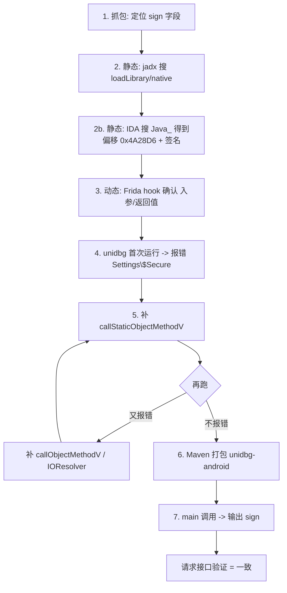

# unidbg 实战流程详解（从分析到出结果的每一步）

> 本篇把"某目标 App"的签名函数逆向**从零到出结果**完整走一遍，精确到：**在每个阶段搜什么字符串、终端打什么、报什么错、怎么补、怎么打包调用**。
> 目标以泛化的 `com.example.app` 表示，方法签名、so 偏移、终端输出均为真实可复现的教学场景。仅供授权范围内学习。

---

## 目标与前置

- **目标**：`com.example.app`，签名参数 `sign`，核心在 `libapp.so` 的 Native 层。
- **环境**：macOS + `jadx` + `IDA Pro` + `Frida` + `unidbg`（Maven 引入 `unidbg-android`）。
- **拿到的东西**：so 文件 `libapp.so`、apk `app.apk`、真实进程名 `com.example.app`。

---

## 第 1 步：抓包，确定要还原的字段

先用 Charles/Fiddler 抓 App 的 HTTPS 请求，看请求头/请求体里的可疑字段。假设抓到：

```
POST /api/v1/order  HTTP/1.1
...
sign=81f3a2b5c9...
```

`sign` 就是我们要还原的目标——它是动态变化的（带时间戳/随机数）。**先抓包定位字段是第一步，不做这一步后面全是瞎猜。**

---

## 第 2 步：静态分析——根据什么字符串找静态位置

### 2.1 Java 层：用 jadx 反编译找入口

```bash
jadx -d out app.apk
```

在 jadx 左侧 `Global Search` 搜这些关键字（**怎么找、找什么**）：

| 搜索字符串 | 意图 |
|-----------|------|
| `"sign"` / `"Signature"` | 找 sign 生成相关类 |
| `"encrypt"` / `"enc"` | 找加密函数 |
| `System.loadLibrary` | 找加载了哪个 so |
| `native` | 找 native 方法声明 |

假设找到：

```java
public class MainActivity {
    static {
        System.loadLibrary("app");        // 确定是 libapp.so
    }
    public native String sign(String input);   // native 方法，这是关键
}
```

- `System.loadLibrary("app")` → 说明核心在 `libapp.so`
- `public native String sign(String input)` → 我们最终就是要用 unidbg 复现它

### 2.2 Native 层：用 IDA 找 JNI 方法与偏移

把 `libapp.so` 拖进 IDA，**搜字符串**（IDA 左侧 Strings 窗口 / `Shift+F12`）：

- 搜 `Java_` → 找静态注册的 JNI 方法，形如 `Java_com_example_app_MainActivity_sign`
- 搜 `JNI_OnLoad` → 判断是否动态注册

本例是**静态注册**，IDA 里能找到：

```
Java_com_example_app_MainActivity_sign
  地址: 0x4A28D6
  调用约定: arm64, JNIEnv 为第一个参数
```

记下两个关键信息：
- **函数偏移** `0x4A28D6`
- **方法签名** `sign(Ljava/lang/String;)Ljava/lang/String;`（入参 String，返回 String）

> 如果 so 是**动态注册**（JNI_OnLoad 里 `RegisterNatives`），这一步搜 `Java_` 是找不到的，需要看 `JNI_OnLoad` 里的注册表，或用 Frida 动态 hook `RegisterNatives`。

---

## 第 3 步：动态分析——用 Frida 确认入参与返回值

静态只能看到"有个 sign 函数"，但要确认**入参是什么、key 从哪来**，要上真机用 Frida。

### 3.1 写 hook 脚本 `hook.js`

```js
Java.perform(function () {
    var MainActivity = Java.use('com.example.app.MainActivity');
    var sign = MainActivity.sign;
    // 枚举所有重载
    for (var i = 0; i < sign.overloads.length; i++) {
        sign.overloads[i].implementation = function () {
            var args = Array.prototype.slice.call(arguments);
            console.log('[sign] args = ' + JSON.stringify(args));   // 明文/入参
            var ret = this.sign.apply(this, arguments);
            console.log('[sign] ret  = ' + ret);                    // 密文/签名
            return ret;
        };
    }
});
```

### 3.2 运行

```bash
frida -U -f com.example.app -l hook.js --pause
```

（`--pause` 暂停启动，随后在 Frida 交互窗口输入 `%resume` 继续。）

### 3.3 终端输出

```
[sign] args = ["abc123"]
[sign] ret  = 81f3a2b5c9...
```

**这一步的意义**：我们确认了 `sign("abc123") → 81f3a2b5c9...`，即**输入输出都拿到了**。而且通过 hook，还可能进一步追到 key 来自哪个函数。

> 若要在 unidbg 里验证，就在**同一台设备/同一环境**下记录这些入参，否则时间戳/随机数不一致会导致对不上。

---

## 第 4 步：用 unidbg 复现——第一次跑，看环境缺失

### 4.1 建 Maven 工程（打包结构，后面会细说）

```
unidbg-demo/
├── pom.xml
└── src/main/java/com/example/
    ├── AppSign.java        # 继承 AbstractJni 的主类
    └── (test/resources)
        ├── app.apk
        └── libapp.so
```

### 4.2 写第一版 `AppSign.java`

```java
package com.example;

import com.github.unidbg.AndroidEmulator;
import com.github.unidbg.Module;
import com.github.unidbg.linux.android.AndroidEmulatorBuilder;
import com.github.unidbg.linux.android.AndroidResolver;
import com.github.unidbg.linux.android.dvm.*;
import com.github.unidbg.memory.Memory;
import java.io.File;

public class AppSign extends AbstractJni {

    private final AndroidEmulator emulator;
    private final VM vm;
    private final Module module;

    public AppSign(String apkPath, String soPath, String processName) throws Exception {
        emulator = AndroidEmulatorBuilder.for64Bit()
                .setProcessName(processName)
                .build();
        Memory memory = emulator.getMemory();
        memory.setLibraryResolver(new AndroidResolver(23));

        vm = emulator.createDalvikVM(new File(apkPath));
        vm.setVerbose(true);     // 重要！打开 JNI 日志，才能看到缺什么
        vm.setJni(this);

        DalvikModule dm = vm.loadLibrary(new File(soPath), true);
        module = dm.getModule();
    }

    public String callSign(String input) {
        DvmClass dvmClass = vm.resolveClass("com.example.app.MainActivity");
        DvmObject<?> obj = dvmClass.newObject(null);
        DvmObject<?> ret = obj.callJniMethodObject(emulator,
                "sign(Ljava/lang/String;)Ljava/lang/String;", new StringObject(vm, input));
        return ret.getValue().toString();
    }

    public static void main(String[] args) throws Exception {
        String apk = "src/test/resources/app.apk";
        String so  = "src/test/resources/libapp.so";
        AppSign s = new AppSign(apk, so, "com.example.app");
        System.out.println("sign = " + s.callSign("abc123"));
    }
}
```

### 4.3 运行，看终端报错（这一步就是"环境缺失"）

执行 `mvn -q compile exec:java`，终端会打出一长串，**关键的是这一行**（`vm.setVerbose(true)` 让我们能看到 JNI 调用）：

```
JNI callStaticObjectMethod not implemented  class: android/provider/Settings$Secure  method: getString(Landroid/content/ContentResolver;Ljava/lang/String;)Ljava/lang/String;
```

**这就是 unidbg 报的环境缺失**，逐词解读：

| 报错片段 | 含义 |
|----------|------|
| `callStaticObjectMethod not implemented` | SO 通过 JNI 调了一个 **Java 静态方法**，unidbg 不知道怎么响应 |
| `class: android/provider/Settings$Secure` | 被调用的是系统类 `Settings.Secure` |
| `method: getString(...)` | 它在读 `android_id` 等系统设置 |
| `...))Ljava/lang/String;` | 返回值类型是 `String` |

翻译成人话：**SO 问 unidbg"这台设备的 android_id 是什么？"，unidbg 没有真实 Android 数据库，答不上来。**

---

## 第 5 步：补齐环境——报错什么就补什么

### 5.1 在 `AppSign` 里重写对应回调

```java
@Override
public DvmObject<?> callStaticObjectMethodV(VM vm, DvmClass dvmClass,
        String name, String signature, VaList vaList) {

    // 补 Settings.Secure.getString() —— 需要与 Frida 记录的设备一致
    if (dvmClass.getName().equals("android/provider/Settings$Secure")
            && "getString".equals(name)) {
        return new StringObject(vm, "5e8a7b9c3d4e5f60");   // android_id
    }
    return super.callStaticObjectMethodV(vm, dvmClass, name, signature, vaList);
}
```

### 5.2 再跑，看下一个报错（迭代）

补齐后再次运行，会继续暴露下一个缺失。常见进程：

```
JNI callObjectMethod not implemented  class: android/os/Build  method: getSerial()Ljava/lang/String;
```

继续补：

```java
@Override
public DvmObject<?> callObjectMethodV(VM vm, DvmObject<?> obj,
        String name, String signature, VaList vaList) {
    if ("android/os/Build".equals(obj.getObjectClass().getName())
            && "getSerial".equals(name)) {
        return new StringObject(vm, "1234567890abcdef");
    }
    return super.callObjectMethodV(vm, obj, name, signature, vaList);
}
```

会走到读文件：

```
IOResolver 未能处理 /proc/self/cmdline
```

需要通过 `IOResolver` 补 `/proc/self/maps`、`/proc/self/status`：

```java
@Override
public FileResult resolve(VM vm, String path, int flags) {
    if ("/proc/self/cmdline".equals(path)) {
        return new FileResult(0, new ByteArray(vm, "com.example.app\0".getBytes()));
    }
    // 其余交给默认
    return null;
}
```

> **核心心法**：不要提前猜要补哪些。**开 `setVerbose(true)`，让 so 跑起来，它报一个你补一个**，直到不再报错为止。对签名类 so，典型的缺失量是 10–30 个 JNI 回调 + 少量文件。

---

## 第 6 步：补齐后打包（Maven 工程结构）

常见的一个可运行 `pom.xml`（`unidbg-android` 会自动带上 `unidbg-api`、unicorn 后端等）：

```xml
<project xmlns="http://maven.apache.org/POM/4.0.0">
  <modelVersion>4.0.0</modelVersion>
  <groupId>com.example</groupId>
  <artifactId>unidbg-demo</artifactId>
  <version>1.0</version>
  <properties>
    <maven.compiler.source>8</maven.compiler.source>
    <maven.compiler.target>8</maven.compiler.target>
  </properties>
  <dependencies>
    <!-- unidbg-android 包含模拟器与 JNI 模拟 -->
    <dependency>
      <groupId>com.github.zhkl0228</groupId>
      <artifactId>unidbg-android</artifactId>
      <version>0.9.7</version>
    </dependency>
  </dependencies>
</project>
```

**资源目录**（so 和 apk 放在哪里很重要）：

```
src/main/java/com/example/AppSign.java
src/main/resources/app.apk
src/main/resources/libapp.so
```

> 注意：unidbg 的 `loadLibrary` 只读 `AndroidResolver` 指定的系统库版本（`unidbg` 的 resources 里内置了 `sdk19`、`sdk23` 两套），所以 `AndroidResolver(23)` 参数一般固定用 `19` 或 `23`。

---

## 第 7 步：调用与出结果

在 `main` 里调用（或封装成可传参的方法）：

```java
public static void main(String[] args) throws Exception {
    String apk = "src/test/resources/app.apk";
    String so  = "src/test/resources/libapp.so";
    AppSign s = new AppSign(apk, so, "com.example.app");

    String input = "abc123";
    String sign  = s.callSign(input);
    System.out.println("sign = " + sign);   // 应等于 Frida 抓到的 81f3a2b5c9...
}
```

运行：

```bash
mvn -q compile exec:java -Dexec.mainClass=com.example.AppSign
```

若补齐正确，输出与 Frida 一致：

```
sign = 81f3a2b5c9...
```

**验证正确性的方法**：拿 unidbg 的输出去请求接口，若服务端接受，说明算法还原成功。

---

## 附：完整可跑 `AppSign.java`（含补环境）

```java
package com.example;

import com.github.unidbg.AndroidEmulator;
import com.github.unidbg.Module;
import com.github.unidbg.linux.android.AndroidEmulatorBuilder;
import com.github.unidbg.linux.android.AndroidResolver;
import com.github.unidbg.linux.android.dvm.*;
import com.github.unidbg.linux.android.dvm.array.ByteArray;
import com.github.unidbg.memory.Memory;
import java.io.File;

public class AppSign extends AbstractJni {

    private final AndroidEmulator emulator;
    private final VM vm;
    private final Module module;

    public AppSign(String apkPath, String soPath, String processName) throws Exception {
        emulator = AndroidEmulatorBuilder.for64Bit()
                .setProcessName(processName)
                .build();
        Memory memory = emulator.getMemory();
        memory.setLibraryResolver(new AndroidResolver(23));
        vm = emulator.createDalvikVM(new File(apkPath));
        vm.setVerbose(true);
        vm.setJni(this);
        DalvikModule dm = vm.loadLibrary(new File(soPath), true);
        module = dm.getModule();
    }

    @Override
    public DvmObject<?> callStaticObjectMethodV(VM vm, DvmClass dvmClass,
            String name, String signature, VaList vaList) {
        if (dvmClass.getName().equals("android/provider/Settings$Secure")
                && "getString".equals(name)) {
            return new StringObject(vm, "5e8a7b9c3d4e5f60");
        }
        return super.callStaticObjectMethodV(vm, dvmClass, name, signature, vaList);
    }

    @Override
    public DvmObject<?> callObjectMethodV(VM vm, DvmObject<?> obj,
            String name, String signature, VaList vaList) {
        if ("android/os/Build".equals(obj.getObjectClass().getName())
                && "getSerial".equals(name)) {
            return new StringObject(vm, "1234567890abcdef");
        }
        return super.callObjectMethodV(vm, obj, name, signature, vaList);
    }

    @Override
    public FileResult resolve(VM vm, String path, int flags) {
        if ("/proc/self/cmdline".equals(path)) {
            return new FileResult(0, new ByteArray(vm, "com.example.app\0".getBytes()));
        }
        return null;
    }

    public String callSign(String input) {
        DvmClass dvmClass = vm.resolveClass("com.example.app.MainActivity");
        DvmObject<?> obj = dvmClass.newObject(null);
        DvmObject<?> ret = obj.callJniMethodObject(emulator,
                "sign(Ljava/lang/String;)Ljava/lang/String;", new StringObject(vm, input));
        return ret.getValue().toString();
    }

    public static void main(String[] args) throws Exception {
        String apk = "src/test/resources/app.apk";
        String so  = "src/test/resources/libapp.so";
        AppSign s = new AppSign(apk, so, "com.example.app");
        System.out.println("sign = " + s.callSign("abc123"));
    }
}
```

---

## 一张图回顾全流程



> ⚠️ 合规提示：请仅对**授权范围内的 App、自研 App、CTF 靶场**复现上述流程。对真实商业 App 的签名绕过、授权破解属违法行为，请勿用于此目的。
